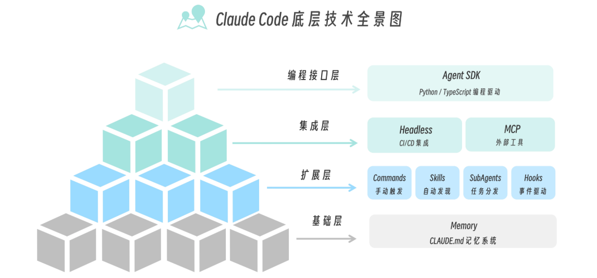
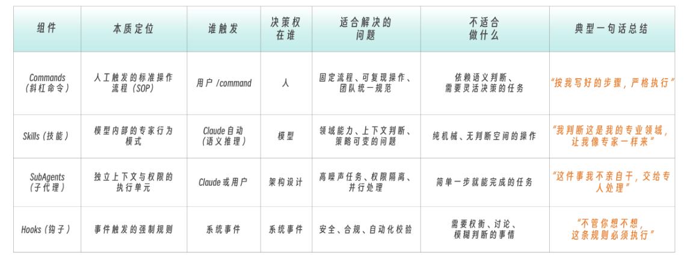
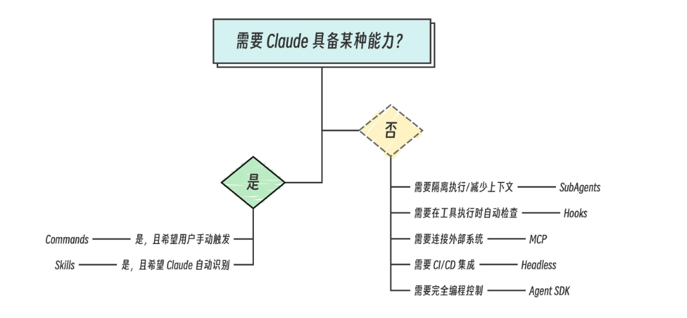
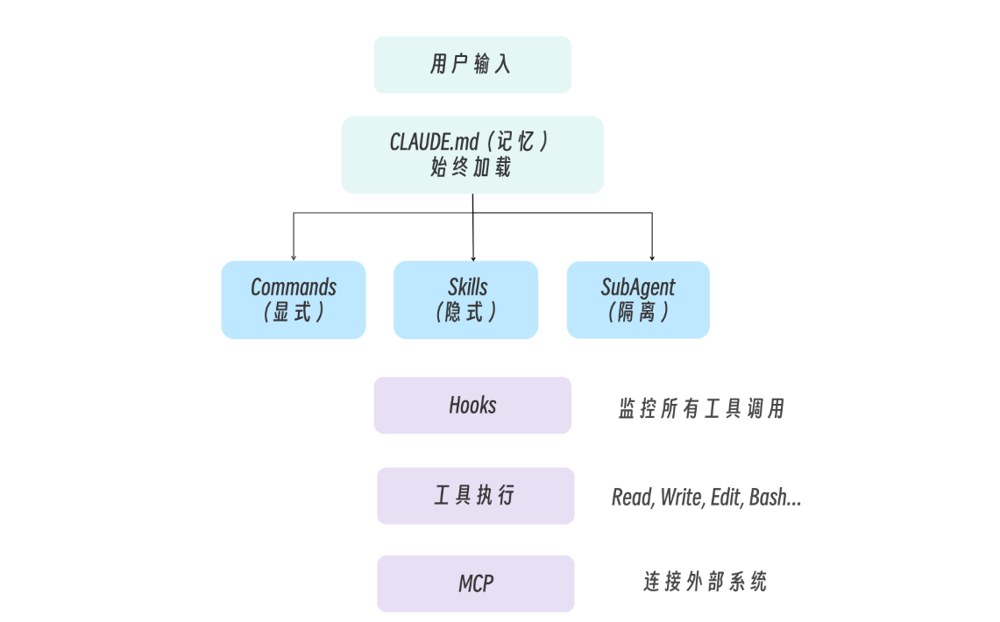
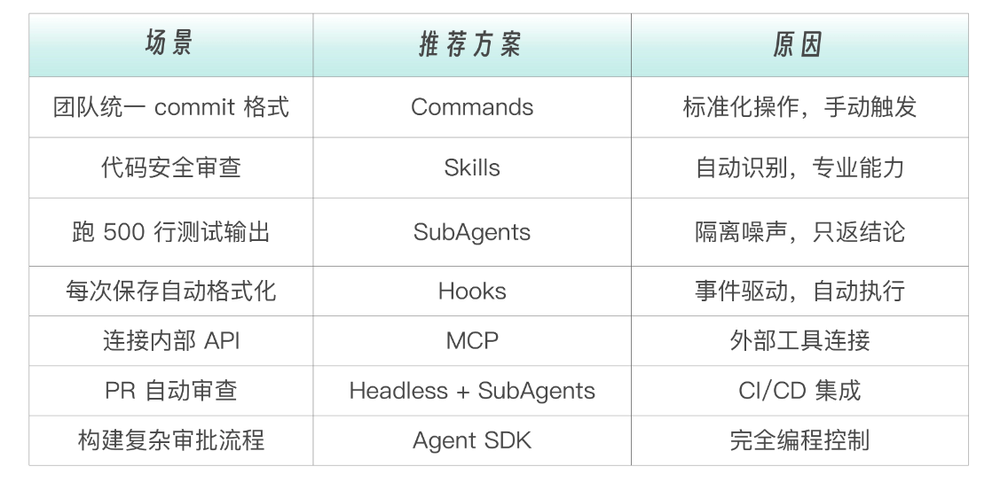

# 002 · 01｜登台远望：Claude Code 底层技术全景导览

> 📖 原文出处：[极客时间 - 黄佳《Claude Code 工程化实战》](https://time.geekbang.org/column/article/942438)
>
> 📅 学习时间：2026-06-28

---

## 这篇文章在回答什么问题？

1. **Claude Code 到底是个什么东西？** 很多人觉得它就是命令行里的 ChatGPT、高级版 Copilot。作者说「都对，但都不完整」——那它的完整身份是什么？
2. **Claude Code 的技术架构长什么样？** 六大模块（Memory / Commands / Skills / SubAgents / Hooks / Headless / MCP / SDK）不是平铺的，它们之间是什么关系？怎么分层？
3. **面对一个真实需求时，该用哪个组件？** 什么时候用 Skill 而不是 Command？什么时候用 Hooks 而不是 SubAgent？有没有选型方法？
4. **这些组件能组合起来用吗？** 单个组件只能做单一任务，怎么串成一个完整的自动化流程？

---

## 原文转述

> 以下是对原文核心论证的完整转述，用我自己的话重新讲一遍。夹杂的理解和说明用 💡 标记。

### 一、Claude Code 的真正身份不是「工具」，是「平台」

文章一开始先抛了一个问题：你眼中的 Claude Code 是什么？

可能的答案：能读懂代码的 AI 助手、命令行里的 ChatGPT、帮你写代码的工具、比 Copilot 更强的东西。

黄佳老师说，这些都对——但都不完整。

**Claude Code 的真正身份是：一个可编程、可扩展、可组合的 AI Agent 框架。**

这个表述挺关键的。打个比方：就像你不会说 VS Code 只是一个文本编辑器（它是，但远不止于此），Claude Code 也远不只是一个 AI 助手。它更像一个**你可以构建自己的 AI 工作流的平台**。

💡 理解「平台」和「工具」的区别：工具是你拿来就用，用完就放；平台是你可以在上面搭东西。Claude Code 给你提供了 Memory、SubAgents、Skills、Hooks 这些「积木」，你可以按自己的需求组合出不同的工作流。

---

### 二、快速上手部分：值得记录的三个实用信息

文章花了些篇幅讲安装和使用，大部分是常规内容。但有几个点跟我们的实操经验直接相关，特别记一下：

**1. API Key + 中转方案**
国内直连 Anthropic API 不通，但 Claude Code 支持自定义 API 端点：
```bash
export ANTHROPIC_BASE_URL=https://your-relay-service.com/v1
export ANTHROPIC_API_KEY=sk-xxx
```
中转服务存在 Key 泄露和断服风险，不要用来处理敏感代码。

**2. 开源替代品**
如果搞不定网络和支付，OpenCode 是目前最好的平替，支持 DeepSeek、Qwen、Kimi 等国内模型，概念框架几乎可迁移。

💡 这正好对应我们之前做的「CC + DeepSeek」环境搭建实践（见 [001-cc-with-deepseek](../../001-cc-with-deepseek/)）。我们用 DeepSeek API 就是这个路线——设置 `ANTHROPIC_BASE_URL` + `ANTHROPIC_API_KEY` 绕过登录界面。

**3. CC Switch 工具**
社区工具 `cc-switch`（`npx @songhe/cc-switch`）可以一键在 Claude API 和国产模型之间切换，本质是帮你改写 `.claude/settings.json`。还有一个 `CCS` 工具管「哪个账户 + 哪个代理」。核心功能都是改 `settings.json`。

---

### 三、核心认知升级：使用者 vs 驾驭者

文章这里用了一个非常清晰的对比：

| | 使用者 | 驾驭者 |
|------|-------|-------|
| **模式** | 用户 → 输入问题 → Claude 回答 → 完成 | 用户 → 配置 Agent → Agent 自主工作 → 自动完成 |
| **本质** | 被动使用 | 主动驾驭 |
| **类比开车** | 知道方向盘、油门、刹车怎么用 | 理解发动机、变速箱、刹车系统原理，能改装 |
| **对应 CC** | 知道怎么提问、让 AI 写代码 | 理解 Memory、SubAgents、Skills、Hooks 原理，能构建自定义工作流 |

💡 这个对比其实精准概括了整门课的定位——不是教你「怎么提问」，而是教你「怎么设计一个能自己干活的 AI 工程系统」。两者差了一个维度。

---

### 四、四层技术架构（全文核心）

黄佳老师把 Claude Code 的底层能力拆成了四层。从下往上：

```
编程接口层：Agent SDK          ← 代码驱动，完全编程控制
集成层：Headless + MCP          ← 连接外部世界，进 CI/CD
扩展层：Commands + Skills       ← 四大核心组件，能力中心
       + SubAgents + Hooks
基础层：Memory（CLAUDE.md）    ← 长期记忆，始终存在
```



#### 4.1 基础层：Memory

核心文件 `CLAUDE.md`，就是 Claude 的「新员工手册」。写清楚技术栈、代码风格、重要规则（比如「不要直接 commit 到 main」）。

Memory 是**分层级的**：
```
~/.claude/CLAUDE.md           # 全局（所有项目共用）
    ↓
项目根目录/CLAUDE.md          # 项目级
    ↓
项目根目录/.claude/rules/*.md # 模块级（特定目录）
```

💡 这个设计很聪明——全局放个人信息（比如「我是前端开发」），项目级放项目规范，模块级放特定约束（比如「这个微服务不能调外部 API」）。不同层级的约束可以叠加。

#### 4.2 扩展层：四大核心组件

这是全文的重点。四个组件各有不同的触发方式和适用场景：

**Commands（斜杠命令）**
- 触发方式：**用户手动输入 `/command`**
- 确定性：100%
- 适合：标准化操作（团队统一 commit 格式、部署流程）
- 本质：显式触发、可复用、可审计的固化流程

**Skills（技能）**
- 触发方式：**AI 自动判断（语义推理）**，也可以手动触发
- 确定性：概率性
- 适合：有「领域感」的任务（安全审查、架构评审、性能分析）
- 本质：把专家的「判断+行为模式+检查标准」打包成一个整体

Skills 和 Tools 的区别（这一段的解释特别好）：
- Tool = 函数调用，解决的是「**我能不能做**」
- Skill = 行为模式 + 触发逻辑，解决的是「**我该不该做、怎么做、做到什么程度**」

💡 举个例子：Tool 是「给你一台扫描仪」，Skill 是「给你一个安全专家的思维」。扫描仪可以被调用，但安全专家知道什么时候该扫描、扫哪里、扫到什么程度算过关、什么情况要深挖。

**SubAgents（子代理）**
- 触发方式：**Claude 决定或用户指定**
- 确定性：可控（可以手动也可以自动）
- 适合：隔离执行——高噪声任务（大量日志分析）、需要特定权限的任务
- 核心价值：上下文隔离，主对话保持干净

**Hooks（钩子）**
- 触发方式：**事件自动触发**（比如 Claude 要调用 Edit 工具时）
- 确定性：100%
- 适合：自动化检查——格式化校验、安全检查、日志记录
- 本质：关键节点的守门人

💡 这四种组件的「确定性」排序非常关键。文章后面专门用一张图来说明：Commands 和 Hooks 是 100% 确定性触发，Skills 是概率性的语义判断，SubAgents 介于两者之间。

#### 4.3 集成层：Headless + MCP

- **Headless**：让 Claude Code 在 CI/CD 中无人值守运行。比如 GitHub Actions 中 `claude --headless "Fix all linting errors"`
- **MCP**：让 Claude 连接外部工具（数据库、Jira、自定义 API 等）。本质是把外部系统变成 Claude 可调用的工具

💡 集成层解决的是「AI 怎么走出终端」的问题。Headless 让它能进自动化流水线，MCP 让它能连外部系统。没有这两样，CC 就只是一个本地 CLI 玩具。

#### 4.4 编程接口层：Agent SDK

当配置文件式的扩展不够用时，直接写代码来驱动 Claude。适合构建自定义 Agent——完全控制流程、自定义工具、复杂工作流。

---

### 五、文章给出的核心框架

#### 5.1 四大组件对比表

| 组件 | 触发方式 | 确定性 | 适合场景 | 核心比喻 |
|------|---------|--------|---------|---------|
| **Commands** | 用户手动 `/cmd` | 100% | 标准化操作 | 固定流程 |
| **Skills** | AI 语义判断 / 手动 | 概率性 | 领域专家式任务 | 专家思维 |
| **SubAgents** | AI 决定 / 用户指定 | 可控 | 隔离执行 | 外包工人 |
| **Hooks** | 事件自动触发 | 100% | 自动化检查 | 守门人 |



#### 5.2 技术选型决策树

面对一个需求时，按以下顺序判断：

1. 这是「能力」还是「检查机制」？
   - 能力 → 继续判断
   - 检查/拦截/记录 → **Hooks**
2. 需要手动触发还是 AI 自动判断？
   - 手动（标准化流程）→ **Commands**
   - 自动（有领域感、判断依赖上下文）→ **Skills**
   - 两者都行（任务重、需要隔离）→ **SubAgents**
3. 是不是要连接外部系统？
   - 是 → **MCP**
   - 不是 → 回到第 1 步
4. 需不需要进 CI/CD？
   - 是 → **Headless**



> 决策选择示例：[见附录A：技术选项示例]()


#### 5.3 数据流向

一个典型请求经过四层架构的处理流程：

```
用户输入 "帮我修复 src/api.js 中的安全漏洞"

Step 1 Memory层：加载 CLAUDE.md → 了解到这是 Node.js 项目，安全修复必须带测试
Step 2 扩展层：
    - Commands 没被触发（用户没打 /）
    - Skills：识别「安全漏洞」→ 激活 security-review Skill
    - SubAgents：Skill 指示创建子代理执行测试（上下文隔离）
Step 3 Hooks：准备 Edit 文件时 → Hook 自动做安全检查
Step 4 MCP：如果配了 Jira MCP → 自动更新 ticket 状态

关键洞察：Memory 是基础设施（始终存在），扩展层是能力中心（按需激活），Hooks 是守门人（监控一切）
```



#### 5.4 Plugins = 打包容器

Plugins 不是一种新能力，而是把 Commands + Skills + SubAgents + Hooks 打成一个可分发、可版本化的包。类比 npm 包之于 JS 文件。

```
my-team-plugin/
├── commands/review.md
├── skills/security-check/SKILL.md
├── agents/test-runner.md
├── hooks/pre-edit.sh
└── plugin.json
```

---

### 六、本文提到的技术关键词（待深入）

| 关键词 | 文中怎么说的 | 我目前的理解程度 | 后续怎么跟进 |
|--------|-------------|-----------------|-------------|
| **Agent Loop** | 核心循环：构建消息 → LLM → 工具调用 → 拼回上下文 → 循环。Claude Code/Codex/Aider 底层都是这个 | 理解了概念，但具体实现细节不清楚 | 后续有 Harness 加餐 |
| **MCP** | 让 Claude 连接外部工具和服务的协议 | 只知道是连接外部系统用的，不知道协议细节 | 后续章节 |
| **Headless** | 无人值守模式，CI/CD 中运行 | 概念清楚，没实操过 | 后续章节 |
| **Agent SDK** | 编程接口，用代码驱动 Claude | 只知道名字 | 后续章节 |
| **CC Switch** | 社区工具，一键切换模型/管理 MCP | 已经算是理解了 | 可以试装一下 |
| **OpenCode** | CC 的最佳开源平替，支持国产模型 | 知道了，但没试过 | 有空可以试试对比 |
| **Plugins** | 打包机制，把组件组合打包分发 | 概念清楚 | 第 16 讲 |
| **A2A 协议** | 文中评论区提到，SubAgent 和 A2A 不是一个层次：SubAgent 在本地系统内部，A2A 是 Agent 间通信协议 | 知道区别，具体 A2A 协议不了解 | 作者之前的《MCP和A2A前沿实战》专栏 |

---

## 我的疑惑与待验证

1. Skills 的「语义判断」具体是怎么做的？文中描述了一个判断链（这是代码吗？→ 哪类代码？→ 有用户输入吗？……），这是写在 Skill 文件里的规则，还是 Claude 自己的推理？
2. SubAgents 的权限隔离能做到多细？评论区提到 `.claudeignore`+Rules+Hook 实现 RBAC，具体配置长什么样？
3. Memory 三层（全局/项目/模块）的优先级和覆盖规则是什么？如果全局和项目级冲突了怎么处理？
4. Hooks 能拦截所有工具调用吗？有没有哪些操作是 Hook 拦截不了的？
5. 文中提到「Commands 即将被 Skills 统一取代」——取代后原来的 `/command` 显式触发方式还能保留吗？

---

## 评论区高价值讨论

### 🔥 1. Agent Loop 大家都一样，Claude Code 差异在哪？

**读者 TheOne（32 赞）**：如果抛开模型层和生态，只看 CLI Agent 本身——核心就是一个 Loop「构建消息 → LLM → 工具调用 → 拼回上下文 → 循环」。Codex、OpenCode 底层都是这个，开源实现几百行就能跑一个。那 Claude Code 的优势到底在哪？

**作者答**（要点翻译）：
核心 Loop 确实没秘密。真正的差异不在 Loop 里，在 Loop 之外：

- **上下文组装策略**：不是把所有文件都塞给 LLM，而是基于任务语义选择需要加载的内容。靠的是文件元信息的智能筛选（git status、eslint 的 lint 结果的整合），以及渐进式加载。
- **工具设计哲学**：常规 CLIs 将工具视为 LLM 的「手」；Claude Code 的工具拥有 Bash（和用户一样的权限）、Edit（支持 >1000 行的替换）、Write/Read/NotebookEdit，是以「用户同事」的逻辑来设计的。
- **对错误的处理**：CC 把「重试→失败→降级→求助人类」这一套写进了 Agent 框架，确保流程不中断。
- **工程治理体系**：权限、安全、停止、旁路的完整框架——这个是通用层的 Agent OS，用来管底下的 Agent Loop 里面的 Agent。
- **多智能体的结构**：CC 利用 SubAgent 平衡对上下文膨胀和任务噪声的控制；利用 Skills 的渐进式加载增强上下文利用。这套结构让「大任务中的多层决策」不乱。

> 💡 这篇回复其实揭示了 Claude Code 的护城河——不在于 Loop，在于 Loop 之上的工程治理层。Loop 是几百行代码的事，但「怎么让 Loop 跑得稳、不出事、能管得住」才是难点。

---

### 🔥 2. AI 写的代码质量上限在哪？

**读者 Juha（27 赞）**：AI 是靠阅读开源代码训练的，高度不可能超过已有的代码。在 Flink/Doris/Spark 这类复杂项目上，AI 会不会只能产出「玩具」？

**作者答**：AI 时代的技术人员将极度分化——大部分人用 AI 做应用层，会有一小撮硬核工程师钻研底层——反简化、反惰性、强创新。这些人负责管理技术发展、监控 AI 是否越界。

> 💡 这个回答比较宏观但方向对——AI 对于「普通水平的代码」影响最大，顶尖工程仍然需要人。本质上 AI 拉高了地板，但没有降低天花板。

---

### 🔥 3. AI 生成的代码通过了测试，但心里完全没底

**读者 Shopman（24 赞）**：用 SDD 做了一个项目，一行代码没写，测试全过了——但失控感极强。代码不是自己写的，测试测了什么心里没底。

**作者答**：我们正处在「程序员编程 → 人机交互编程范式转换」的初期，这个过渡期特别短而且覆盖面极广。这个失控感是真实的、普遍的。

> 💡 这个问题正好命中专栏要解决的核心——怎么从「让 AI 写代码」升级到「让 AI 可靠地写代码」。靠的就是 Memory/Skills/SubAgents/Hooks 这些工程机制。

---

### 🔥 4. 课程到底教原理还是教配置？

**读者 和尚（55 赞）**：看了 GitHub 上的代码，感觉就是一些配置。课程到底是在教我们从工程痛点推导出解决方案的「原理」，还是在教「工具配置」？

**作者答**（精华版）：这是课程最希望被问到的问题。和尚提出了一个真实案例——AI 写的代码上线后爆雷，因为 AI 没考虑全链路对端体验。问题的本质不是「AI 写错了代码」，而是 AI「没有被赋予在设计阶段审视影响面的职责和上下文」。

作者的思考方向：
- 是否需要在方案设计阶段引入专门负责影响面分析和链路回溯的 Sub-Agent？
- 是否需要用 Skill 固化「上线前全链路端到端体验 checklist」？
- 是否能通过 Hooks 在代码合并前自动执行 SLA 风险评估？

> 💡 这条讨论是全文评论区最有价值的一条。它说明了一个关键原则：**不是学「配置怎么写」，而是学「遇到什么问题时该用哪个机制来解决」**。配置只是手段，工程思维才是目标。

---

### 🔥 5. 其他有价值的碎片

- **Skills 内部怎么用 SubAgents？** 有读者问「Skill 怎么指定多个 SubAgent」，作者纠正是反过来的——**把 Skills 配置到 SubAgent 里，不是把 SubAgent 写到 Skill 里**。
- **C++ AI 编码为什么差？** 训练数据分布 + 语言复杂度共同决定。但提示词策略的差距比想象得大——在 CLAUDE.md 中声明确切的 C++ 上下文（标准版本、依赖库、编译选项等），质量有明显提升。
- **Commands 会废弃吗？** 作者确认 Commands 完全可以被 Skills 取代，后续章节有详述。
- **MCP 是全量加载还是按需加载？** 协议本身没有按需加载定义，但 Claude Code 在 Harness 层自己做了按需加载。
- **知识库连接**：如果要做内部知识库查询，适合用 MCP（创建一个知识库 MCP server）。

---

## 相关链接

- 📁 [原文原始数据](../article-origin/002/)
- 📦 [课程 GitHub 仓库](https://github.com/huangjia2019/claude-code-engingeering)
- 🔗 [CC Switch](https://github.com/farion1231/cc-switch) | [OpenCode](https://opencode.ai)

---

## 附录

### 附录A：技术选项示例

问题 1：我希望团队成员都用统一的 commit message 格式。
- 这是一种“能力”吗？是的，是生成规范 commit message 的能力。
- 希望手动触发还是自动识别？手动触发更合适，因为不是每次对话都需要 commit。
- 答案：适合用 Commands（创建一个  /commit  命令）。

问题 2：每当 Claude 要修改代码时，我想自动检查是否符合我们的安全规范。
- 这是一种“能力“吗？不是，这是一种“检查机制”。需要在工具执行时自动检查？ 
- 对，在 Edit 工具执行前检查。
- 答案：适合用 Hooks（创建一个 pre-Edit hook）

问题 3：我想让 Claude 能够查询我们内部的知识库。
- 这是一种“能力”吗？ 不完全是，这是“连接外部数据源”。
- 需要连接外部系统？ 知识库是一个外部系统
- 答案：适合用 MCP（创建一个知识库 MCP server）。

为了帮助你快速匹配，我也准备了一份场景 VS 方案的速查表。



---

### 四大组件实践练习

这部分已展开为独立的实操文档，包含五个版本的渐进式构建过程（零配置 → Commands → Skills → SubAgents → CI/CD），每一步都有具体的配置文件示例。

👉 [查看实践文档：渐进式构建代码审查自动化](./practice-code-review.md)