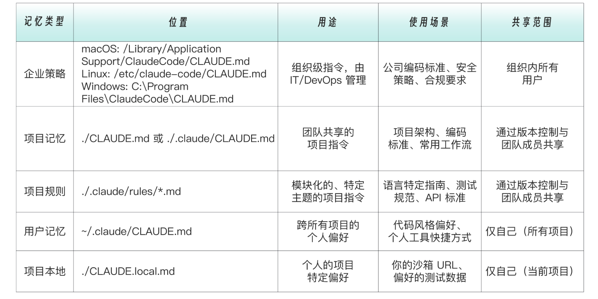
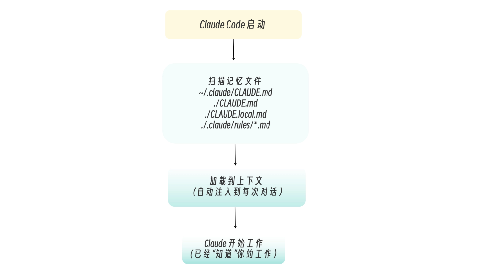
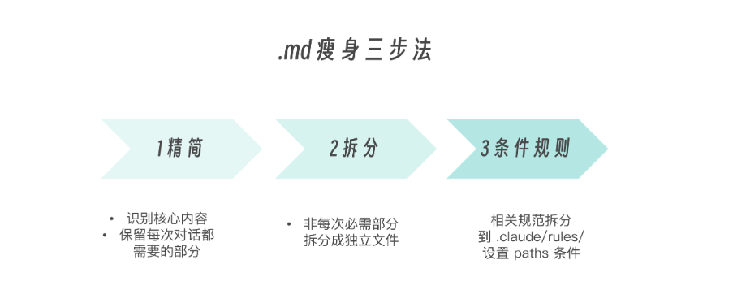

# 003 · 02｜过目不忘：Claude Code 记忆系统与 CLAUDE.md

> 📖 原文出处：[极客时间 - 黄佳《Claude Code 工程化实战》](https://time.geekbang.org/column/article/942948)
>
> 📅 学习时间：2026-06-28

---

## 这篇文章在回答什么问题？

1. **Claude 每次新对话都「失忆」怎么办？** 上一句刚说技术栈是 Fastify + TypeScript，下一轮对话又问你在用什么框架。怎么让它记住？
2. **CLAUDE.md 到底怎么写才有效？** 很多人写了 CLAUDE.md 但效果不好——要么写得太泛泛等于没写，要么写太多导致上下文爆炸。高效的 CLAUDE.md 遵循什么原则？
3. **五层记忆架构分别装什么？** 全局/项目/本地/Rules/Auto Memory——每一层放什么内容？哪些要提交到 Git，哪些不该？
4. **记忆管理和优化的实操怎么做？** `/memory` 命令怎么用？已有的 CLAUDE.md 太臃肿怎么瘦身？

---

## 原文转述

### 一、CLAUDE.md 解决的核心问题：「失忆症」

黄佳老师用两段代码描述了 Claude Code 初学者的共同痛点：

**问题 1：每次对话都要重新纠正技术选型**
```
第一次对话：帮我写一个登录接口
→ Claude 用 Express + JS 写了
→ 纠正：我们用 Fastify + TypeScript！
→ Claude 重写

第二次对话：帮我写一个订单接口
→ Claude 又用 Express + JS 写了  ← 又来一遍！
```

**问题 2：每次都要重新说一遍个人偏好**
```
项目A：帮我做 PPT → 做好了 → 调一下格式，16:9，加 Speaker Notes
项目B：帮我做 PPT → 又没加 Speaker Notes  ← 又要纠正
```

> 💡 这其实也是我们实操中的真实感受——每次纠正 Claude 都很烦。CLAUDE.md 就是把这些反复纠正的信息一次固化，让 Claude 每次对话开始时自动学习。

文章的定位很清楚：**CLAUDE.md 是给 Claude 的「项目入职手册」——每次对话自动阅读，了解项目背景和底层规则。**


---

### 二、五层记忆架构

从上到下（加载优先级从高到低）：

```
层级1 企业策略级    /Library/Application Support/ClaudeCode/CLAUDE.md  ← IT统一部署
层级2 用户全局级    ~/.claude/CLAUDE.md                              ← 跨项目个人偏好
层级3 项目团队级    项目根目录/CLAUDE.md                            ← 提交到 Git
层级4 本地个人级    项目根目录/CLAUDE.local.md                      ← 不提交 Git
层级5 规则目录      .claude/rules/*.md                              ← 条件加载
```



#### 层级 1：企业策略级

组织范围内的强制策略，IT/DevOps 统一管理。内容包括：公司编码标准、安全策略、合规要求、禁止使用的库。

💡 个人和小团队可以跳过这一层。

#### 层级 2：用户全局级

**位置**：`~/.claude/CLAUDE.md`

跨所有项目生效的个人偏好。比如：
- 沟通语言（中文回复、代码注释英文）
- 代码风格（缩进 2 空格、async/await 优先）
- 常用工具（包管理器用 uv、编辑器 VS Code）

> 💡 **层级覆盖规则**：用户级会被项目级覆盖。个人喜欢 2 空格，但项目要求 4 空格 → 按项目来。

#### 层级 3：项目团队级（核心）

**位置**：项目根目录 `./CLAUDE.md`，**应提交到 Git**。

存放项目特定的知识：技术栈、目录结构、编码规范、常用命令、API 响应格式、错误处理模式等。

💡 这是最重要的一层——团队共享、版本管理、新人 clone 下来就能用。

#### 层级 4：本地个人级

**位置**：`./CLAUDE.local.md`，**必须加入 `.gitignore`**。

存放个人的东西：本地环境配置（localhost:3000）、测试账号、当前工作备注、调试技巧、敏感信息。

#### 层级 5：规则目录（进阶）

**位置**：`.claude/rules/*.md`

按主题拆分的规则文件，支持**条件作用域**——只在编辑特定文件时才加载：

```markdown
---
paths:
  - "src/**/*.test.ts"
  - "tests/**/*.ts"
---

# 测试规范
使用 Vitest + React Testing Library...
```

💡 这个设计的巧妙之处：不是把 5000 行规范全灌给 Claude，而是当前在写测试脚本时只加载测试规范，写 API 时只加载 API 规范。这是**上下文工程**的核心手法。



---

### 三、编写高效 CLAUDE.md 的四大原则

#### 原则 1：Less is More（精简是必须的）

这不是建议，是**必须**。CLAUDE.md 每一行在每次对话开始时都会被注入上下文。冗余不是无害的，是持续消耗 Token。

> 💡 判断标准：「如果我不写，Claude 大概率会做对 → 那就不要写」。比如「写高质量的代码」「使用有意义的变量名」——这些话 Claude 本来就知道。

#### 原则 2：具体优于泛泛

**❌ 无效写法**：
```markdown
# 代码质量
请写出高质量的代码。代码应该是可读的。遵循最佳实践。
```

**✅ 有效写法**：
```markdown
# TypeScript
- 使用 interface 定义对象结构，type 用于联合类型
- 禁止 any，使用 unknown + 类型守卫
- 函数参数 > 3 个时，使用对象参数
```

#### 原则 3：关键三问 WHY/WHAT/HOW

- **WHY**：为什么用 Zod？→ 让 Claude 理解**决策逻辑**，面对相似场景时能做出一致判断
- **WHAT**：能做什么，不能做什么？→ 定义**边界**（禁止在 controller 中写 SQL）
- **HOW**：按什么步骤做？→ 给出**可执行的流程**（Step 1→2→3→4，带参考文件路径）

#### 原则 4：渐进式披露

CLAUDE.md 不是什么都塞。正确的做法是**引用而非复制**：

```markdown
## 详细文档
- 数据库设计: 见 docs/database.md
- API 规范: 见 docs/api-spec.md
```

当 Claude 需要细节时，它会按需读取引用文件——而不是每次都把所有内容强塞进上下文。

💡 这跟 Skills 的渐进式披露原理一样——按需加载 > 全量注入。

---

### 四、三种实战场景

#### 场景 1：为新项目创建记忆

**Step 1**：`/init` 或手动 `touch CLAUDE.md`，填写技术栈、目录结构、组件规范、状态管理策略、常用命令

**Step 2**：创建 `CLAUDE.local.md`（本地笔记）+ 加入 `.gitignore`

**Step 3**：可选地创建 `.claude/rules/` 条件规则

#### 场景 2：给已有的 CLAUDE.md 瘦身

当 Claude 变慢、上下文警告频繁出现、早期内容被忘记时：

1. **识别核心**：哪些是每次对话都需要的？
2. **拆分出去**：详细 API 文档、数据库 Schema 移到独立文件，在 CLAUDE.md 里只留引用（`@docs/api.md`）
3. **条件化**：测试规范放到 `rules/testing.md`，设 `paths` 条件只在编辑测试文件时加载



#### 场景 3：记忆管理命令

```
/memory              # 查看当前所有记忆
/memory edit         # 编辑项目级 CLAUDE.md
/memory edit user    # 编辑用户级记忆
/memory edit local   # 编辑本地级记忆
```

也可以直接用自然语言：「请记住，我们项目使用 pnpm 而不是 npm」→ Claude 会提议帮你更新 CLAUDE.md。

---

### 五、Auto Memory

Claude Code 在 `~/.claude/projects/<project>/memory/` 下会自动生成 Auto Memory，记录模型在实践中沉淀的经验。

> 💡 这个设计其实就是我们之前用的 Memory 功能——写跨会话持久化的经验笔记。CLAUDE.md 决定「系统被告知什么」，Auto Memory 决定「系统在实践中学到了什么」。

---

## 文章核心框架

### 五层记忆速查表

| 层级 | 位置 | Git | 内容 | 加载方式 |
|------|------|-----|------|---------|
| 企业策略 | 系统目录（IT部署） | ❌ | 安全合规、禁止项 | 强制 |
| 用户全局 | `~/.claude/CLAUDE.md` | ❌ | 个人代码风格、工具偏好 | 每次 |
| 项目团队 | `./CLAUDE.md` | ✅ | 技术栈、目录结构、团队规范 | 每次 |
| 本地个人 | `./CLAUDE.local.md` | ❌ `.gitignore` | 本地环境、测试账号、工作备注 | 每次 |
| 规则目录 | `.claude/rules/*.md` | ✅ | 分类规范（带条件作用域） | 按需 |

### 无效 vs 有效 CLAUDE.md

| 无效（泛泛） | 有效（具体） |
|-------------|-------------|
| 写高质量的代码 | TypeScript strict 模式，禁止 any |
| 注意错误处理 | 业务错误 → BusinessError 类，Controller 不 try-catch |
| 保持代码整洁 | 函数参数 > 3 → 用对象参数 |

---

## 技术关键词（待深入）

| 关键词 | 文中怎么说的 | 我的理解程度 | 后续跟进 |
|--------|-------------|-------------|---------|
| **Auto Memory** | 自动记录模型在项目中学到的模式 | 概念清楚，已经在自己用了 | 可以研究下它的生成逻辑 |
| **条件作用域 paths** | Rules 文件只在编辑特定路径文件时加载 | 知道用法，没实操过 | 项目变复杂时可以试 |
| **上下文压缩** | Claude 对话过长时自动压缩早期内容 | 知道有这个机制，不清楚细节 | 后续章节 |

---

## 我的疑惑与待验证

1. 五层之间的**覆盖和冲突规则**是什么？全局说 2 空格、项目说 4 空格——这个能理解。但如果企业级禁止某个库，项目级又需要它，谁能覆盖谁？
2. Rules 的 `paths` 条件匹配是精确匹配还是 glob 模式？多个规则文件的内容是同时加载还是按路径匹配加载？
3. Auto Memory 的生成逻辑是什么？是每隔 N 轮对话自动总结，还是需要手动触发？
4. CLAUDE.md 和后续的 Skills 在使用场景上有重叠——什么时候该写到 CLAUDE.md，什么时候该做成 Skill？

---

## 评论区高价值讨论

### 🔥 1. 多微服务项目怎么管理 CLAUDE.md？

**读者**：管理多个微服务，每个都是独立 git 仓库。跨多个微服务工程时，项目级 CLAUDE.md 和 rules 应该怎么管理更高效？

**作者答**：两套模式——
- **聚合仓**：每个服务目录下放自己的 CLAUDE.md
- **分散仓 + 全局**：在每个仓库有自己的配置，同时在用户全局 `~/.claude/CLAUDE.md` 中声明通用技术栈（比如「我们的微服务统一用 Go + gRPC」）

> 💡 这个回答的核心思路：**通用的放全局，特定的放项目**。跟我们之前讨论的「全局 vs 项目级」分层逻辑一致。

---

### 🔥 2. CLAUDE.md 的本质是什么？

**读者**：CLAUDE.md 的本质是在 Token 有限的情况下尽量少走弯路。所以更本质的原则是——如果新增一行带来的 Token 消耗，大于它节省的纠错 Token → 不值得写。

**作者答**：非常认同这个思路——每行都是成本。可以用一个简单的核算：`这一行每次对话消耗 X Token × 每次对话 × 对话次数` vs `如果不写，每次都纠正要消耗 Y Token`。

---

### 🔥 3. 最佳实践：让 Claude 自己维护 CLAUDE.md

**读者**：Claude Code 官方团队推荐——每次纠正完 Claude 之后，说一句「更新你的 CLAUDE.md」，让 Claude 自行总结纠错内容并更新记忆文件。

> 💡 这跟 `/memory` 命令的自然语言触发达成一致——不是每次手动编辑，而是让 Claude 自己沉淀经验。

---

### 🔥 4. 投稿对比：Memory vs Rules vs Skill vs Command

**读者**：

| 机制 | 功能 |
|------|------|
| **CLAUDE.md** | 始终给我记着 |
| **Rules** | 做某事前提醒一下 |
| **Skill** | 具体做的时候，哪些特定操作，拿来用，别推理 |
| **Command** | 好用的过程积累下来，下次懒得再重述 |

> 💡 这四句话比原文的四大组件表格更好记——用一种人格化的方式来描述每个组件的职责。

---

### 🔥 5. 接手老项目怎么写 CLAUDE.md？

**读者**：后端工程师清楚后端的架构分层，能写好 CLAUDE.md。但如果接手一个不熟悉技术栈的老前端项目，该怎么设计 CLAUDE.md？

**作者答**：
1. 先让 Claude 自动分析项目生成初步 CLAUDE.md（`/init`）
2. 阅读 Claude 生成的版本，修正不准确的地方
3. 在实践中逐步补充——遇到反复纠正的场景就记下来

> 💡 实用建议：CLAUDE.md 不需要一次性完美，可以迭代演化。最有效的信息往往来自**被纠正过两次以上的事情**。

---

## 相关链接

- 📁 [原文原始数据](../article-origin/003/)
- 📦 [课程 GitHub 仓库 - 02-Memory 示例](https://github.com/huangjia2019/claude-code-engingeering)

---

## 附录

### 每一个级别给出CLAUDE.md的说明和示例

#### 企业策略级记忆设定

企业策略级记忆设定的作用是组织范围内的指令，由 IT/DevOps 统一管理和部署组织。适合内容是，公司编码标准、安全策略、合规要求以及禁止使用的库或模式。通过配置管理系统（MDM、Group Policy、Ansible 等）部署，确保在所有开发者机器上一致分发。

位置：
- macOS: /Library/Application Support/ClaudeCode/CLAUDE.md
- Linux: /etc/claude-code/CLAUDE.md
- Windows: C:\Program Files\ClaudeCode\CLAUDE.md

示例：
```Bash
# 公司开发策略

## 安全要求
- 禁止在代码中硬编码任何密钥或敏感信息
- 所有 API 调用必须使用 HTTPS
- 用户输入必须经过验证和清理

## 合规要求
- 所有日志必须排除 PII（个人身份信息）
- 数据库连接必须使用加密传输

## 禁止项
- 禁止使用未经审批的第三方库
- 禁止直接访问生产数据库
```

---

#### 用户级内容设定

**用户级内容设定**承载的是你的全局偏好，即跨所有项目生效的个人偏好，如个人代码风格，沟通语言设置，通用工作习惯等。比如说我希望所有的 PPT 都是 16:9，黑体字。这种设置就应该放在此处。

位置：~/.claude/CLAUDE.md

示例：

```Bash
# 个人偏好

## 沟通方式
- 使用中文回复
- 代码注释使用英文
- 解释简洁直接，不要过多铺垫

## 通用代码风格
- 缩进使用 2 空格
- 优先使用 async/await
- 变量命名使用 camelCase
- 常量命名使用 UPPER_SNAKE_CASE

## 我的常用工具
- 包管理器: uv
- 编辑器: VS Code
- 终端: zsh
```

用户级记忆会被项目级覆盖。如果你个人喜欢 2 空格缩进，但项目要求 4 空格，那就用 4 空格。

---

#### 项目级团队共享规范

团队共享规范是团队共享的项目知识，应该提交到 Git。适合存放的内容包括项目架构和技术栈、团队编码规范、重要的设计决策和常用命令。

位置：项目根目录的  ./CLAUDE.md

示例（一个后端 API 项目）：

```Bash
# 项目：订单服务 API

## 技术栈
- Node.js 20 + TypeScript
- Fastify（Web 框架）
- Prisma（ORM）
- PostgreSQL + Redis
- Zod（数据验证）

## 目录结构
src/ 
├── routes/ # 路由定义 
├── controllers/ # 请求处理 
├── services/ # 业务逻辑 
├── repositories/ # 数据访问 
├── schemas/ # Zod schemas 
└── types/ # 类型定义

## API 响应格式
```typescript
interface ApiResponse<T> {
  success: boolean;
  data?: T;
  error?: { code: string; message: string };
}
编码规范
- TypeScript strict 模式
- 禁止使用 any，使用 unknown + 类型守卫
- 所有 API 端点必须有 Zod schema 验证
- 业务错误使用自定义 Error 类
常用命令
- pnpm dev - 启动开发服务器
- pnpm test - 运行测试
- pnpm prisma migrate dev - 运行数据库迁移
```

---

#### 本地级个人工作空间

个人工作空间用于记载个人工作笔记，不提交到 Git，适合内容包括本地环境配置、个人调试技巧、当前工作备注，敏感信息（测试账号等）。

位置：项目根目录的./CLAUDE.local.md

示例：

```Bash
# 本地开发笔记

## 我的环境
- 本地 API: http://localhost:3000
- 测试数据库: order_service_dev
- Redis: localhost:6379

## 测试账号
- admin@test.com / test123
- user@test.com / test123

## 当前工作
- 正在重构支付模块
- 参考 PR #234 的讨论
- 周五前完成

## 调试技巧
- 订单状态机日志: LOG_LEVEL=debug pnpm dev
- 查看 Redis 缓存: redis-cli KEYS "order:*"
```

> 这里重点强调一下：记得把  CLAUDE.local.md  加入  .gitignore！

```Bash
echo "CLAUDE.local.md" >> .gitignore
```

当在项目越来越大，周期越来越长的时候，一个属于自己的本地记忆空间其实还蛮有用的。

在和 Claude Code 多轮对话之后，Claude 也会自动压缩对话历史。经过一系列提示词之后，我自己也不知道自己进行到哪一步了，想查一下以前的提示词，或者几天前和 Claude Code 的关键讨论，但是无处寻踪了。而拥有一个记忆空间，定期把关键内容更新就能够解决这个问题（自己更新或者让 Claude 帮忙更新关键点都行）。

---

#### 规则目录：分类组

rules，这是一个比较高阶的技巧，初学者可以作为知识了解一下，也可以先略过不看。Rules 是按主题组织的规则文件，支持条件作用域（也就是视情况来确定是否加载该记忆内容），适合场景包括 CLAUDE.md 变得太长时，不同文件类型需要不同规范时，以及前后端分离的项目。

位置：.claude/rules/*.md

目录结构：

```Bash
.claude/
└── rules/
    ├── typescript.md      # TypeScript 规范
    ├── testing.md         # 测试规范
    ├── api-design.md      # API 设计规范
    └── security.md        # 安全规范
```

条件作用域示例：.claude/rules/testing.md

```Bash
---
paths:
  - "src/**/*.test.ts"
  - "tests/**/*.ts"
---

# 测试规范

## 命名
- 单元测试: `*.test.ts`
- 集成测试: `*.integration.test.ts`

## 结构
使用 Arrange-Act-Assert 模式：

```typescript
describe('OrderService', () => {
  describe('createOrder', () => {
    it('should create order when stock is available', async () => {
      // Arrange
      const mockProduct = createMockProduct({ stock: 10 });

      // Act
      const order = await orderService.createOrder(mockProduct.id, 1);

      // Assert
      expect(order.status).toBe('created');
    });
  });
});

## 覆盖率要求
- 业务逻辑: > 80%
- 工具函数: > 90%
- 路由/控制器: 可以较低
```

> 此处的关键特性是paths字段让这个规则只在编辑测试文件时生效，不会浪费其他场景的上下文空间。