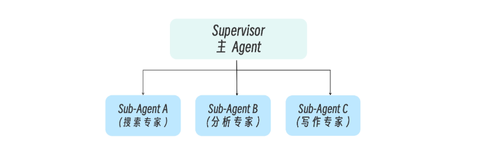
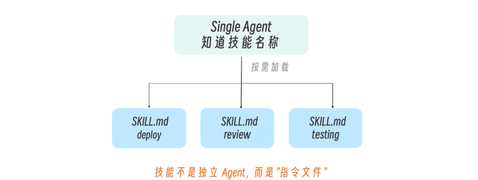
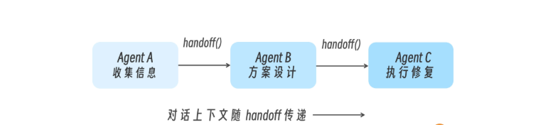
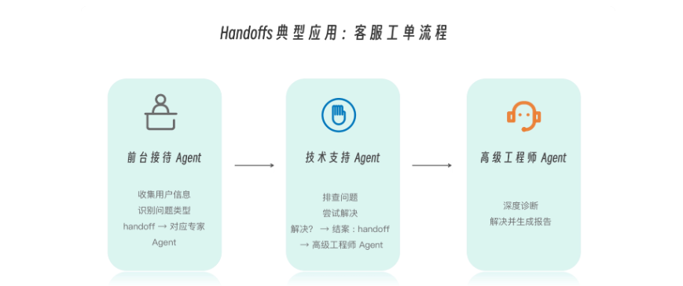
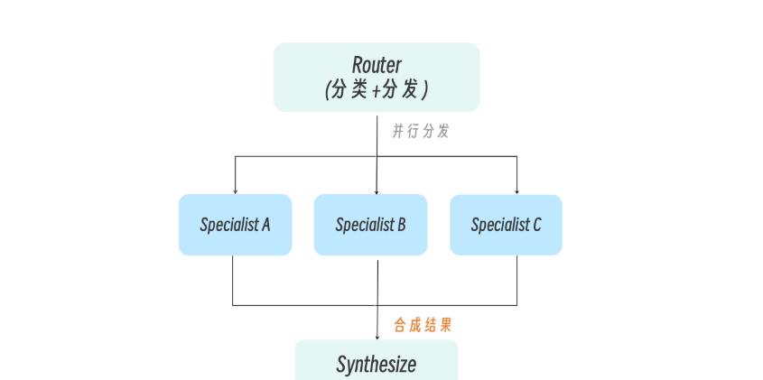
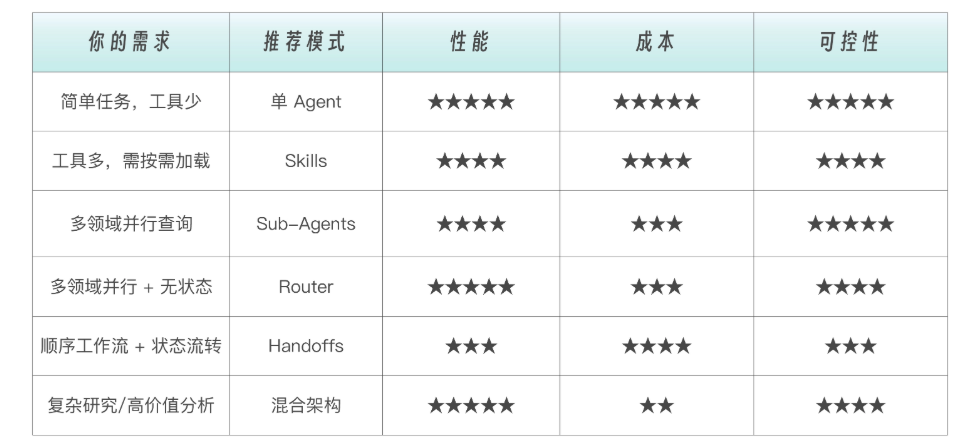

# 005 · 04｜登堂入室：从 Sub-Agents 到 Multi-Agent 的工程指南

> 📖 原文出处：[极客时间 - 黄佳《Claude Code 工程化实战》](https://time.geekbang.org/column/article/943942)
>
> 📅 学习时间：2026-06-30

---

## 这篇文章在回答什么问题？

1. **为什么有些人能一眼看懂新的 AI 产品设计，而我只能停留在「它好像用了 Agent」的层面？** 差的不在于读没读源码，而是脑子里有没有一套架构式思维框架。
2. **什么时候该从单 Agent 升级到多 Agent？** 不是越复杂越好——过早引入多 Agent 是经典误区。真正的触发信号是什么？
3. **多 Agent 系统有哪些核心设计模式？** Sub-Agents / Skills / Handoffs / Router 四种，分别解决什么问题、怎么选？
4. **性能和成本怎么量化权衡？** 多 Agent 系统有 15 倍 token 成本放大效应，值得吗？

---

## 原文转述

### 一、核心认知：架构式思维框架

黄佳老师开篇抛了一个很巧妙的问题：为什么有些 AI 新产品，你一眼就能「看懂」它的设计逻辑，另一种却始终云里雾里？

答案：**脑子里有没有一套稳定的架构式思维框架。** 有这套框架的人，面对陌生产品不会从零开始理解，而是下意识问三个问题：

1. 它解决的核心工程问题是什么？
2. 它选择的是单 Agent 还是多 Agent 结构？
3. 它是在用上下文换智能，还是用架构换可控性？

💡 这套框架不是某个具体工具的用法，而是**可以拆解任何 AI 产品的通用方法论**。你学会了，看到 Cursor/Copilot/OpenClaw 都能快速理解它们的架构取舍。

---

### 二、何时升级到多 Agent？一个前置判断

LangChain 的选择指南里有一句话被当作了原则：

> *"Start with a single agent. Add tools before adding agents. Graduate to multi-agent patterns only when encountering clear architectural limits."*

翻译成大白话：**先用一个 Agent 跑着，不够了加工具，还不够了再加 Agent。**

两个核心触发信号：

**信号一：上下文管理挑战**。当多个领域的专业知识塞不进一个 prompt 时——模型进入「迟钝区」（dumb zone），性能显著下降。

**信号二：分布式开发需求**。当不同团队需要独立维护各自的 Agent——安全团队维护审计 Agent，测试团队维护测试 Agent，各迭代各的。

```
单 Agent 的困境：
┌─────────────────────────────────────────────────┐
│ System Prompt:                                  │
│   - 你是代码专家（200行指令）                    │
│   - 你也是测试专家（150行指令）                  │
│   - 你还是安全审计专家（180行指令）              │
│   - 你同时是文档撰写专家（100行指令）            │
│   ...                                           │
│   Token 爆炸，模型注意力分散                     │
└─────────────────────────────────────────────────┘
```

💡 黄佳老师补充：他自己做项目一般先做简单 Demo，两三个礼拜后感觉认知过载了，才开始考虑架构设计。不是一开始就画大图。

---

### 三、四种核心设计模式（全文核心）

四种模式不是互斥的，实际项目中经常组合使用。

#### 模式一：Sub-Agents（集中式编排）

**一句话**：老板（Supervisor）拆任务，派给专门的下属（Sub-Agent），下属干完活只把结论带回来。



```
Supervisor Agent
    ├── Sub-Agent A（研究）→ 独立上下文 → 返回结论
    ├── Sub-Agent B（编写）→ 独立上下文 → 返回代码
    └── Sub-Agent C（审查）→ 独立上下文 → 返回报告
```

**Anthropic 的真实案例**：Research 功能采用 Sub-Agent 架构——LeadResearcher（Opus 4）分析查询，并行派出 3-5 个 SubAgent（Sonnet 4）各自搜索，结果汇聚后综合输出。

**工程数据**：
- 复杂查询的研究时间缩短约 90%
- 但 token 消耗是普通对话的 **15 倍**
- 换来了 **90.2% 的性能提升**

💡 **性价比公式**：多 Agent → 花 15 倍 token → 得 90% 性能提升。值不值看任务价值——高价值研究值得，普通增删改查不值得。

---

#### 模式二：Skills（渐进式加载）

**一句话**：还是单 Agent，但能力按需加载——一开始只知道能力名称和描述，需要时才加载完整指令。



```
单 Agent 的上下文
├── 始终加载：Skill 名称列表 + 简短描述（轻量）
├── 使用时加载：被触发 Skill 的完整说明书
└── 不加载：未触发的 Skill 详细指令
```

**关键区别**：
```
Sub-Agent：独立的上下文 → 适合大量信息过滤
Skill：    共享的上下文 → 适合需要连贯对话的场景
```

💡 Skills 其实就是「用 prompt 切换替代 Agent 切换」——更轻量，但也缺少上下文隔离。LangChain 把 Skills 也列为一种「准多 Agent」模式。

---

#### 模式三：Handoffs（状态驱动的切换）

**一句话**：活跃 Agent 根据对话状态动态切换——Agent A 干完自己的阶段，显式交接给 Agent B。



```
信息收集 Agent → [交接] → 问题诊断 Agent → [交接] → 解决方案 Agent
```

**关键实现细节**：Claude Code 中**不存在 `handoff()` API**——Handoffs 是通过 Prompt + 状态约束工程模拟出来的模式，不是框架特性。

三要素：
1. 明确的阶段状态（State）
2. 每个阶段都有角色约束
3. **显式的阶段完成条件**（Exit Criteria）——这是 Handoffs 稳定运行的核心

💡 适合客服工单流程、多阶段审批这类「有明确先后顺序」的业务。



---

#### 模式四：Router（路由分发与合成）

**一句话**：Router 对用户输入做语义拆分，分发给不同的专业 Agent 并行处理，最后合成统一回复。



```
用户：「退货政策是什么？最近销售数据如何？」

Router 分解：
├── 退货政策 → 政策文档 Agent
└── 销售数据 → 数据分析 Agent
        ↓
合成结果 → 统一回答
```

在 Claude Code 中的三种形态：
1. 主 Agent 中的一段路由决策逻辑（最常见）
2. 一个可调用的 Tool（Router-as-Tool）
3. 一个轻量 Sub-Agent（只分类不执行）

💡 本质都是一件事：**先判断「这是什么问题」，再决定「交给谁处理」**。

---

### 四、LangChain 的量化对比

三种场景的性能测试结果非常有参考价值：

| 模式 | 单任务请求 | 重复请求效率 | 多领域查询 |
|------|----------|------------|----------|
| **Sub-Agent** | 有额外开销 | 中等 | 省 40%+ token |
| **Skills** | 开销最低 | 好（有状态） | 中等 |
| **Handoffs** | 低开销 | 最好（有状态） | 不适合 |
| **Router** | 中等 | 弱（无状态） | 省 40%+ token |

关键结论：**多领域查询中，有上下文隔离的模式（Sub-Agent、Router）token 效率显著更优——节省 40% 以上。**

---

### 五、Anthropic 的 Token 经济学

Anthropic 公开的工程数据：

- 多 Agent 系统 **95% 的性能波动**归于三个因素：Token 使用量 80% + 工具调用 7.5% + 模型选择 7.5%
- **选择更合适的模型（如 Sonnet 4）带来的性能提升 > 单纯翻倍 token 预算**
- 多 Agent 系统普遍有 **15 倍 token 成本放大**，只适合高价值、高复杂度任务

### 四大生产挑战

1. **状态性带来的级联风险**：一个 SubAgent 的轻微错误 → 后续全部偏离。对策：每级输出端设检查点
2. **非确定性调试**：需要完整的生产链路追踪（Production Tracing）
3. **部署复杂度**：不能简单「停机更新」，需要渐进式部署（Rainbow Deployment）
4. **同步瓶颈**：当前 SubAgent 之间信息流受限，未来方向是异步 + 消息通道

---

### 六、五大黄金法则

```
1. 从单 Agent 开始 → 只在遇到明确瓶颈时才升级
2. 先加工具，再加 Agent → Tools 是最小的扩展单位
3. 选对模型 > 堆更多 token → 升级模型效果超过翻倍预算
4. 上下文隔离是核心价值 → 多 Agent 第一价值不是并行，是隔离
5. Token 成本要求高价值任务 → 不是所有场景都值得多 Agent
```

---

### 七、架构演进路径

```
第一阶段  单 Agent + Tools      大多数初期场景
    ↓ 工具增多、prompt 臃肿
第二阶段  单 Agent + Skills     渐进式能力加载
    ↓ 需要独立上下文和专业知识
第三阶段  Supervisor + SubAgents  不同领域拆分
    ↓ 多类型任务流并存
第四阶段  混合架构              Router + SubAgent + Handoff
```

💡 最好的架构不是最复杂的，而是**恰好满足需求的最简架构**。黄佳老师自己的习惯：先做 Demo，感觉吃不消了才考虑架构——这个顺序可能比「先画架构图再做」更务实。

---

## 核心框架

### 四种模式速查表

| 模式 | 核心机制 | 上下文隔离 | 并行 | 适合场景 |
|------|---------|----------|------|---------|
| **Sub-Agent** | Supervisor 委派子代理 | ✅ 强 | ✅ | 跨领域独立研究 |
| **Skills** | 按需加载 prompt | ❌ 弱 | ❌ | 工具多但单次只用几个 |
| **Handoffs** | 状态驱动 Agent 切换 | 选择性 | ❌ | 多阶段流程（客服） |
| **Router** | 语义拆分 + 并行分发 | ✅ 强 | ✅ | 多源并行查询 |



### 升级决策树

```
需要多 Agent 吗？
├─ 单一领域 + <5 个工具 + <50K tokens → 不需要（单 Agent + Prompt）
├─ 单一领域 + >10 个工具 → Skills 模式
├─ 多领域 + 需要独立上下文 → Sub-Agent 模式
├─ 多步骤状态流转 → Handoffs 模式
└─ 跨多数据源并行查询 → Router 模式
```

---

## 技术关键词（待深入）

| 关键词 | 文中位置 | 理解程度 | 后续跟进 |
|--------|---------|---------|---------|
| **dumb zone** | 上下文接近满载时性能显著下降的区域 | 概念清楚 | 留意实践中触发时机 |
| **Effort Scaling** | Anthropic 在 Prompt 层引入的努力分配规则 | 新概念 | Anthropic 原文 |
| **Rainbow Deployment** | 新旧版本 Agent 共存迁移 | 概念清楚 | 后续生产部署相关 |
| **Production Tracing** | 完整链路追踪，记录每个 Agent 的输入决策输出 | 概念清楚 | 观察性工具选型 |
| **OpenClaw** | 开源项目，设计走克制路线 | 听说了 | 可以看看源码 |

---

## 我的疑惑与待验证

1. Handoffs 在 Claude Code 里没有原生 API——通过 Prompt 模拟够稳定吗？Exit Criteria 写不好是不是就卡死了？
2. Router 和 Sub-Agent 在多领域查询场景都省 40%+ token——那我该怎么在两者之间选？
3. 15 倍 token 放大是普遍规律还是 Anthropic 特定用例的数字？小项目也会放大这么多吗？
4. 黄佳老师的新书《Agent 设计模式》今年出——这门课的 Skills/Hooks/SubAgent 部分会不会和书有重叠？

---

## 相关链接

- 📁 [原文原始数据](../article-origin/005/)
- 📖 [LangChain: Choosing the Right Multi-Agent Architecture](https://www.blog.langchain.com/choosing-the-right-multi-agent-architecture/)
- 📖 [Anthropic: Multi-Agent Research System](https://www.anthropic.com/engineering/multi-agent-research-system)
- 📖 [Anthropic: Effective Context Engineering for AI Agents](https://www.anthropic.com/engineering/effective-context-engineering-for-ai-agents)
- 📦 [课程 GitHub](https://github.com/huangjia2019/claude-code-engingeering)

---

## 评论区高价值讨论

### 🔥 1. AI Agent 模式本质是「人类社会分工的仿生学」

**读者 AIKO Nexus（66 赞）**：用 IT 公司组织架构来类比四种模式，非常直观：

| 组织概念 | 对应 Agent 概念 |
|---------|---------------|
| 前台/中台/后台部门 | Agent |
| 下辖子部门/员工 | Sub-Agents |
| 子代理拥有的技能（策划/设计/编程） | Skills |
| 使用技能所需的工具（VS Code/Docker） | Tools |
| 产品开发：需求→设计→开发（串行） | Handoffs |
| 多项目并行管理 | Router |

> 💡 作者置顶了这条留言。这个「仿生学」视角是理解四种模式最好的脑图。

---

### 🔥 2. 更好的分类方式：架构演进 vs 多 Agent 编排

**读者 林龍（12 赞）**：把五种发展阶段拆成两大类更清晰：

```
架构的演进：               多 Agent 的编排：
1. 单 Agent               4. Handoffs
2. Skills                 5. Router
3. Sub-Agent
```

作者认可：「这样更清晰了」。前面三个是单体能力逐步扩展，后面两个是多体之间的协作编排。

---

### 🔥 3. Sub-Agent 和 Router 到底怎么区分？

**多位读者困惑**（dummy-name 21 赞、刘丹 3 赞、自由 1 赞）：Sub-Agent 和 Router 看起来结构一样，怎么区分？

**作者/编辑答**（要点）：
- **结构一样，但「脑子」不一样**——Router 是「无脑接线员」，只做分类分发。Sub-Agent + Supervisor 里，Supervisor（主对话）有大脑，能思考
- **Router 的存在不是因为 Sub-Agent 不能嵌套**——这两件事独立。Router 存在是因为多领域需要并行 + 路由决策简单；Sub-Agent 不嵌套是 Claude Code 的工程安全约束（防无限递归）
- 在多层架构中确实存在 Router → 多个独立 Agent → 各自 Sub-Agent 的模式

> 💡 一句话记：**Router 是工作流编排，下面是无脑分发；Sub-Agent 是代理协作，主 Agent 有脑思考。**

---

### 🔥 4. Token 消耗怎么统计？

**读者 泄矢的呼啦圈（2 赞）**：怎么精确统计 SubAgent 和主 Agent 的 token 消耗？

**作者答**：用 CC 内置命令：
- **`/cost`**：显示当前会话的详细 token 统计和 API 费用
- **`/stats`**：查看使用模式（Max/Pro 会员用这个）
- 参考文档：https://code.claude.com/docs/en/costs

---

### 🔥 5. 为什么单 Agent 很危险？

**读者 叶绘落（1 赞）**：单 Agent + 共享上下文会出现：
- 为了功能代码通过测试 → 去改测试代码
- 为了新需求 → 把已有功能改得面目全非
- 为了自洽 → 做出各种匪夷所思的操作

**作者答**：这不是 Agent 不聪明，而是 **「单 Agent + 共享上下文 + 单一目标函数」的必然结果**。多 Agent 的意义不只是任务拆分（Skills 也能做），而是通过**角色隔离**，把工程约束从 prompt 层前移到架构层。

> 💡 这解释了为什么 Sub-Agent 的核心价值第一是「隔离」不是「并行」——隔离开来互相监督，比一个人自我审查可靠得多。

---

### 🔥 6. 其他有价值碎片

- **Skills 字段名更新**（Leo）：`tools` 已改为 `allowed-tools`（[官方文档](https://code.claude.com/docs/en/skills)）
- **上下文过载信号**（迪沃斯托克）：上下文到 90% 自动压缩；代理响应变慢、质量变差、子代理崩溃时 → 考虑开新会话
- **Handoffs 机制澄清**（到不了的塔）：Claude Code 没有原生 handoff，是用「链式子代理 + 主对话当 Controller + 手动在 prompt 中传递上一步结果」模拟的
- **上下文工程推荐阅读**（Demon.Lee）：作者推荐了两篇文章——[Anthropic: Effective Context Engineering](https://www.anthropic.com/engineering/effective-context-engineering-for-ai-agents) 和 [Claude.ai Context Engineering Guide](https://claude.ai/public/artifacts/f498a4cc-4c45-481c-a6dd-8e1d196dadb0)
