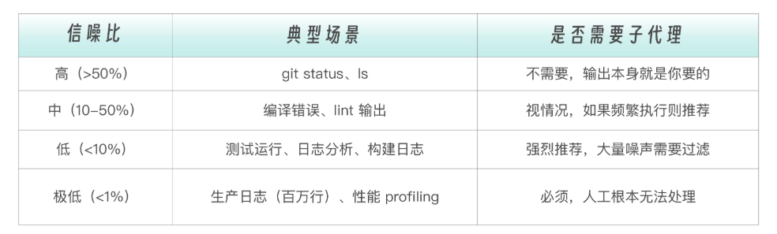
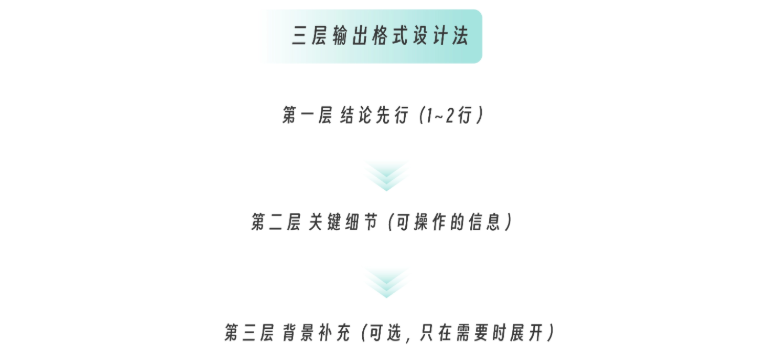

# 007 · 06｜去芜存菁：高噪声任务处理——测试运行器与日志分析器

> 📖 原文出处：[极客时间 - 黄佳《Claude Code 工程化实战》](https://time.geekbang.org/column/article/944525)
>
> 📅 学习时间：2026-07-01

---

## 这篇文章在回答什么问题？

1. **什么是「高噪声输出」任务？** 跑一次测试 300 行日志、查一次日志 10 万行——你真正关心的只有其中几行结论。怎么让 AI 消化这些噪声，只把精华带回来？
2. **怎么判断一个任务值不值得用子代理？** 作者提出了「信噪比」决策框架——超过 50 行输出且你只关心不到 10 行的内容，就该用子代理。
3. **怎么设计子代理的输出格式？** 不是随便写个模板，而是有一套「三层输出格式设计法」和四条原则。
4. **什么时候用 haiku 什么时候用 sonnet？** 测试运行器用 haiku（简单模式匹配），日志分析器用 sonnet（需要推理关联）。

---

## 原文转述

### 一、高噪声输出的真实代价

黄佳老师用一个非常直观的对比开场：

```
你在主对话中让 Claude 跑 npm test → 300+ 行输出涌入上下文
你真正关心的：就一句话——「1 个测试失败，Form 组件提交功能有问题」

但主对话上下文里多了 4,500 tokens 的噪声
而且后续每轮对话都要带着这些噪声
```

**量化对比**：

| | 不用子代理 | 用子代理 |
|------|----------|---------|
| 主对话 tokens | ~8,800 | ~3,700（减 58%） |
| 测试噪声去哪了 | 永远留在主对话 | 子代理独立上下文，执行完释放 |
| 后续对话 | 每轮都要背着噪声 | 轻装上阵 |

> 💡 评论区有读者（马球先生，11 赞）指出单轮对比不完整——应该算上子代理自身的 5,800 tokens。作者修正：主对话确实减少了 58%，子代理有一次性开销，但**只要继续对话 1-2 轮就回本**。更重要的是，比 Token 节省更关键的是**注意力质量**——噪声留在主对话里会影响 Claude 的回答质量。

---

### 二、信噪比决策框架

**核心判断标准**：输出中你真正需要的信息占总输出的比例。

```
经验法则：如果命令输出 > 50 行，且你只关心其中 < 10 行 → 用子代理
```



💡 评论区（Jxin，15赞）补充了一个更深层的观点：子代理隔离噪声只是**层次一**。真正的功夫在**层次二**（输入侧脚本降量 + 知识库匹配 + 输出侧结构化）和**层次三**（闭环沉淀，系统越用越聪明）。

---

### 三、项目一：test-runner（测试运行器）

**场景**：`npm test` → 300 行输出 → 只关心「通过/失败？哪个失败了？」

**配置文件** `.claude/agents/test-runner.md`：

```yaml
---
name: test-runner
description: Run tests and report results concisely. Use after code changes.
tools: Read, Bash, Glob, Grep
model: haiku          # ← 关键决策
---
```

**为什么用 haiku（其他便宜的模型）？** 测试运行器的任务：执行命令（固定流程）+ 解析输出（模式匹配）+ 填充报告模板。haiku 完全胜任，而且更快更便宜。

💡 这个 `model: haiku` 用在我们 DeepSeek 场景下就映射为 `deepseek-chat`——和之前我们的 article-fetcher 选型逻辑一致。

**输出格式**：

```markdown
## Test Results
**Status**: PASS / FAIL
**Total**: X | **Passed**: X | **Failed**: X

### Failed Tests (if any)
- test_name: brief reason

### Recommendations (if failures)
- What to check/fix
```

---

### 四、项目二：log-analyzer（日志分析器）

**场景**：几千到几百万行日志 → 需要识别错误模式、时序推理、根因分析。

```yaml
---
name: log-analyzer
description: Analyze log files and extract actionable insights.
tools: Read, Grep, Glob, Bash
model: sonnet          # ← 需要推理能力
---
```

**为什么用 sonnet 而不是 haiku？** 日志分析需要模式识别、时序推理、关联分析、根因分析——这些是推理型任务，不是简单的模式匹配。

**分析三步法**：
1. Quick Scan（类型统计）
2. Timeline Analysis（时序分析——哪个错误先发生？）
3. Correlation（关联分析——数据库超时是否影响了 API？）

💡 评论区（sky，3赞）问了一个好问题：为什么子代理不严格按照 prompt 中写的 bash grep 步骤执行，而是用内置的 Search/Read 工具？作者答：**prompt 是指导性建议不是强制脚本**，Claude 会自主选择更高效的方法。

---

### 五、输出格式设计方法论（全文最有价值）

子代理的输出是**主对话的输入**。格式设计不好 = 给主对话注入结构化噪声。

#### 三层输出格式设计法

```
第一层：结论先行  → 一眼看到结果（Status: FAIL）
第二层：具体详情  → 可定位问题（哪些测试失败了？原因？）
第三层：行动建议  → 可选的修复方向（只在有价值时出现）
```



#### 四条设计原则

**原则一：结论先行**

```markdown
# ✅ 好
**Status**: FAIL | **Failed**: 3 out of 47

# ❌ 差
Running tests... add(1,2)=3 PASS... subtract(5,3)=2 PASS...（读了半天不知道结果）
```

**原则二：可操作性**——每条信息都能直接指导下一步

```markdown
# ✅ 可操作
- [Form.test.js:45] email field empty → Check handleSubmit, email state not bound

# ❌ 不可操作
- Some tests failed → Please check the code
```

**原则三：分层详略**——该简就简，该详就详

```markdown
全部通过 → 极简：PASS (47/47)
少量失败 → 展开每一项
大量失败 → 按类别归组（DB 连接 8 个、Auth 3 个、Input 1 个）
```

**原则四：为下游消费设计**——Claude 拿到输出后能不能直接用？

```markdown
# ✅ 主对话可以直接基于此生成修复代码
- [src/form.js:45] handleSubmit: email state not updated
  - Root cause: setState missing for email field
  - Fix: Add setEmail(e.target.value) in onChange

# ❌ 主对话还要再去读文件
- Form submit test failed
```

> 💡 黄佳老师说这四原则不仅适用于子代理设计，迁移到写作、口语表达、会议发言等也通用。

---

### 六、两个子代理的对比

| | test-runner | log-analyzer |
|------|-----------|------------|
| **模型** | haiku（便宜快速） | sonnet（需要推理） |
| **输入** | npm test（结构化） | 原始日志（非结构化） |
| **分析难度** | 低（模式匹配） | 高（关联推理） |
| **输出** | 简洁摘要 | 结构化报告 |
| **模型选型逻辑** | 固定流程 + 模板 | 需要模式识别 + 根因推理 |

**共同点**：都是只读型（无 Edit/Write）、都处理高噪声、都有结构化输出、都隔离执行。

---

## 核心框架

### 信噪比决策

```
输出 > 50 行 + 只关心 < 10 行 → 用子代理
```

### 三层输出格式设计

```
结论先行 → 具体详情 → 行动建议
```

### 模型选择速查

```
haiku  → 简单任务（执行、总结、模式匹配）→ deepseek-chat
sonnet → 复杂任务（分析、推理、关联）   → deepseek-v4-pro
```

---

## 评论区高价值讨论

### 🔥 1. Token 节省的正确算法

**读者 马球先生（11 赞）**：讲义里「减少 58%」只看了主对话侧，应该拿 8,800 vs (3,700+5,800) 对比才完整。

**作者修正**：单轮确实是 8,800 vs 9,500，子代理还多花了。但**只要继续对话 1-2 轮就回本**——后续每轮都不需要背着 4,500 tokens 的噪声。而且更重要的是**注意力质量**：噪声会让 Claude 回答质量肉眼可见下降。

---

### 🔥 2. 噪声隔离的三个层次

**读者 Jxin（15 赞）**：子代理隔离噪声只是层次一。层次二是输入侧脚本降量 + 输出侧结构化。层次三是闭环沉淀——系统越用越聪明。

**作者答**：完全认同。三个层次对应新手→熟手→专家的进化路径。

---

### 🔥 3. 隔离与共享的 Tradeoff

**读者 长烽（1 赞）**：如果连续探索同一模块，文件重叠率达 60%，子代理每次都要重读，不是反而浪费 token？怎么平衡？

**作者答**：
- 纯文件读取子代理确实更贵（重叠部分重读）
- 但主对话的隐性成本是上下文累积膨胀——子代理是线性开销，主对话是累积开销
- **混合策略**：连续深挖同一模块 → 直接在主对话做；第一次子代理落盘中间产物 → 后续子代理读文件；传递精准上下文摘要 → 缩小读取范围

> 💡 隔离和共享不是二选一，是根据任务特征动态切换。

---

## 相关链接

- 📁 [原文原始数据](../article-origin/007/)
- 📦 [课程 GitHub - 03-SubAgents 实战](https://github.com/huangjia2019/claude-code-engingeering)
