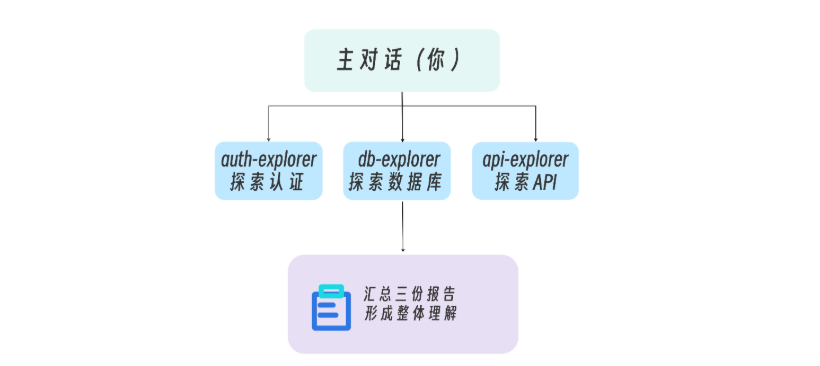
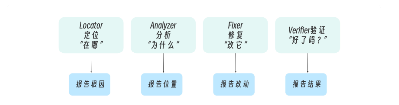

# 008 · 07｜双管齐下：并行探索与流水线编排

> 📖 原文出处：[极客时间 - 黄佳《Claude Code 工程化实战》](https://time.geekbang.org/column/article/945070)
>
> 📅 学习时间：2026-07-02

---

## 这篇文章在回答什么问题？

1. **除了单个 Sub-Agent 干活，多个之间怎么协作？** 这篇讲了两种高级编排模式——并行探索（多个同时跑）和流水线（一个接一个跑）。
2. **什么时候并行、什么时候串行？** 核心标准就一句话：「独立→并行，依赖→流水线」。
3. **流水线阶段之间怎么传递信息？** 最容易出问题的不是每个阶段本身，而是阶段间的「交接契约」——上一阶段的输出如果不能直接用，下一阶段还得重做。
4. **主对话在编排中扮演什么角色？** 不是旁观者，是编排者——在关键节点审批、判断、回退。

---

## 原文转述

### 一、两个真实场景引出两种模式

**场景一：新接手大型项目**。传统方式：逐个模块串行探索（auth 3 小时 → database 5 小时 → api 40 分钟）。中途容易忘记前面的细节。

**并行方案**：三个 explorer 子代理同时工作，各自只探索自己的领域，最后汇总一份综合报告。




**场景二：修复间歇性 bug**。如果让主对话直接处理：搜索代码 200 行 → 分析原因 200 行 → 修复 100 行 → 验证又 300 行。上下文很快塞满。

**流水线方案**：Locator → Analyzer → Fixer → Verifier，每个阶段只返回摘要，主对话保持清洁。



---

### 二、项目一：并行探索

**目录结构**：三个领域专属 explorer，各自只在自己的 domain 内活动。

```yaml
# auth-explorer
name: auth-explorer
tools: Read, Grep, Glob    # 全只读
model: haiku                # 探索任务简单，追求速度
```

**三个 explorer 的共同设计**：
- tools 全部只读，探索不需要修改
- model 都用 haiku（速度快便宜，够用）
- prompt 中明确 「Stay within X domain」——防止越界分析

**并行探索的关键约束：任务必须真正独立**

如果 auth-explorer 发现 role 信息，db-explorer 也发现 role 冗余字段，api-explorer 又发现 role 中间件——三者有关联但因为并行执行，互不知道对方的发现。**这不是 bug，是设计约束。并行探索的综合分析必须由主对话来完成。**

```
子代理 = 收集原始情报
主对话 = 连点成线
```

**并行检查清单**：
- 每个子任务能否独立完成，不需要另一个的结果？否 → 串行
- 遗漏跨模块关联是否可接受（主对话会综合分析）？否 → 考虑串行
- 子任务输出粒度是否匹配？否 → 先统一粒度

💡 **Ctrl+B** 可以把前台子代理切到后台，在并行场景下非常实用。但后台无法弹窗确认权限——只读型 explorer 没这个问题。

---

### 三、项目二：Bug 修复流水线

四个子代理对应四个阶段：

```
Locator（在哪）→ Analyzer（为什么）→ Fixer（怎么改）→ Verifier（对吗）
   只读              只读               读写              Bash
```

**权限递进是关键设计**：前三阶段都是只读，只有 Fixer 有 Edit/Write，Verifier 有 Bash 跑测试。

```
Analyzer → Fixer 这一步是「从只读到读写」的跨越
回退成本最高 → 应该在这里设置人工审批
```

**架构约束：子代理不能嵌套**。流水线的编排者只能是主对话——主对话依次调用，每一步都经过主对话。这其实是好的设计：主对话始终有全局视野，权限天然隔离，调试更容易。

**Resume 机制**：流水线中途断了（网络、关机），可以用 `claude --resume` 恢复。每个子代理有 agent ID，恢复后保留完整上下文。

---

### 四、流水线的核心技术：交接契约

最容易出问题的是**阶段间的信息传递**。如果 Locator 只输出「bug 可能在 auth 模块」，Analyzer 还得自己重做一遍 Locator 的工作。

**每个阶段的输出必须有 Handoff 部分**，告诉下一阶段需要关注什么：

```
Locator → Analyzer：具体文件+函数+行号+证据+关联文件
Analyzer → Fixer：根因+修复方向+推荐方案+边界条件+别碰什么
Fixer → Verifier：改了哪些+为什么+副作用+测试命令+验证标准
```

**经验法则**：交接信息量要充足，让下一阶段**无需重复上一阶段的工作**。

---

### 五、主对话的四种编排姿态

| 形态 | 特点 | 使用场景 |
|------|------|---------|
| 全自动 | 所有阶段自动衔接 | 信任度高 |
| 关键阶段审批 | Analyzer→Fixer 人工确认 | **推荐** |
| 逐阶段审批 | 每步都要确认 | 操作危险 |
| 回退重试 | 遇到问题时回退上游 | 流程卡住 |

> 💡 Analyzer → Fixer 是最关键的审批点——从只读到读写，一旦改错回退成本高。

---

### 六、流水线失败策略

**关键原则：Verifier 失败时，回退到 Analyzer 而不是让 Fixer 重试。**

```
❌ Fixer 再改 → Verifier 再测 → 又失败 → Fixer 再改...（死循环）
✅ 回退到 Analyzer → 结合新证据重新分析 → 新的修复方向
```

Verifier 的失败信息是**新证据**，应该反馈给 Analyzer。Fixer 只负责执行，不负责判断方向。

---

### 七、并行 vs 流水线 vs 混合

**核心判断**：独立→并行，依赖→流水线。

**三种混合模式**：

```
Fan-out → Fan-in：先并行收集，再串行综合（接手新项目）
Pipeline + Parallel：串行流程中某步需要多角度并行（分析阶段多维度检查）
Parallel Pipelines：多条独立流水线并行（同时修多个不相关的 bug）
```

---

## 核心框架

### 并行 vs 流水线速查

| | 并行探索 | 流水线编排 |
|------|---------|----------|
| **适用** | 任务独立 | 任务有依赖 |
| **核心价值** | 速度 + 上下文清洁 | 职责清晰 + 可控性 |
| **权限** | 全只读 | 递进（前面只读，后面才给写） |
| **模型** | haiku（快便宜） | sonnet（推理） |
| **关键风险** | 跨模块关联遗漏 | 交接信息丢失 |

### 交接契约速查

```
Locator必须给：文件+函数+行号+证据 → Analyzer才能直接开始分析
Analyzer必须给：根因+方向+边界 → Fixer才能精准修改
Fixer必须给：diff+原因+副作用+测试命令 → Verifier才能有效验证
```

### 失败处理黄金法则

```
Verifier失败 → 回退到Analyzer（不是Fixer重试）
同一阶段重试 > 2次 → 停下来重新审视
全流水线回退 > 1次 → 人工介入
```

---

## 评论区高价值讨论

### 🔥 1. Agent 谁写的？让 Claude 自己写！

**读者 Geek_1ce179（22 赞）**：老师写的 agent 条理清晰，自己只能写简单描述，怎么写好 agent？

**作者答**：这些 agent 不是我一条条写的——**主要是 Claude Code 写的**。SubAgent、Skills 是 Claude 训练对齐阶段就掌握的技能，它最擅长写自己的配置。你把需求告诉它，让它帮你完善、重写、甚至重构。这个过程是「人机互动形式的元编程」。

> 💡 学写 agent 的正确姿势：手写练手理解原理 → 交给 Claude 完善 → 在它的版本上继续 refine。

---

### 🔥 2. 流水线该用 Skill 还是 Command 沉淀？

**读者 SH（8 赞）**：流水线模式能不能用 Command 或 Skill 封装起来？

**作者答**：推荐用 **Skill 沉淀编排逻辑**。Skill 管「知道怎么做」，SubAgent 管「隔离地去做」，主对话负责串接。三者正交组合。

> 💡 另一读者一鞭直渡清河洛（2 赞）也提到同样思路——流水线的 prompt 每次写太麻烦，封装成 Skill 调用最方便。

---

### 🔥 3. 并行不是真并行

**读者 metathought（2 赞）**：多个子代理没切到后台，本质上还是串行执行？

**作者答**：你说得对。Ctrl+B 展示的是**结构上的并行性**，不是系统执行层面的并行性。Claude Code 一直强调子代理解决的是控制边界，不是真正高并发提速。

---

### 🔥 4. 确定性流程就该用确定性框架

**读者 Geek_55d08a（2 赞）**：流程编排需求稳定的话，不如用 LangGraph？

**作者答**：工程直觉很对。真正的判断是三件事是否同时落地——输入分布、失败模式、SLO。三件都有了，值得用 LangGraph/Temporal 投入稳定流水线；少一件，CC 主对话+Skill 沉淀就是性价比最高的形态。

> 💡 一个经典反模式：把「跑顺了」当成「稳定了」，急着把 prompt 翻译成 DAG，结果发现需求又漂了。

---

## 相关链接

- 📁 [原文原始数据](../article-origin/008/)
- 📦 [课程 GitHub - 03-SubAgents 实战](https://github.com/huangjia2019/claude-code-engingeering)
- 🔗 [Awesome Claude Code SubAgents](https://github.com/VoltAgent/awesome-claude-code-subagents)
