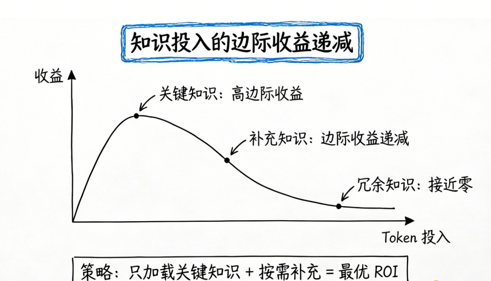
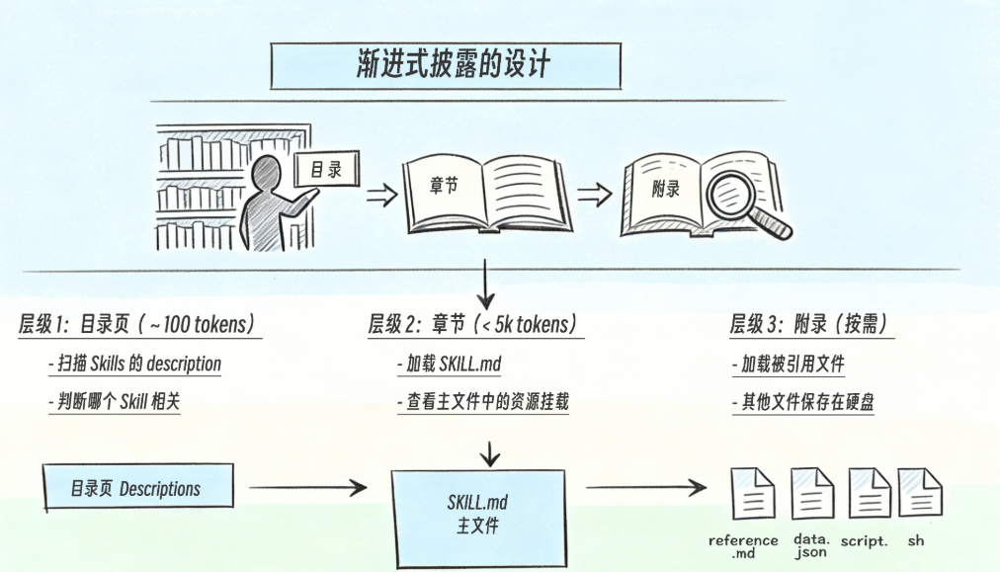
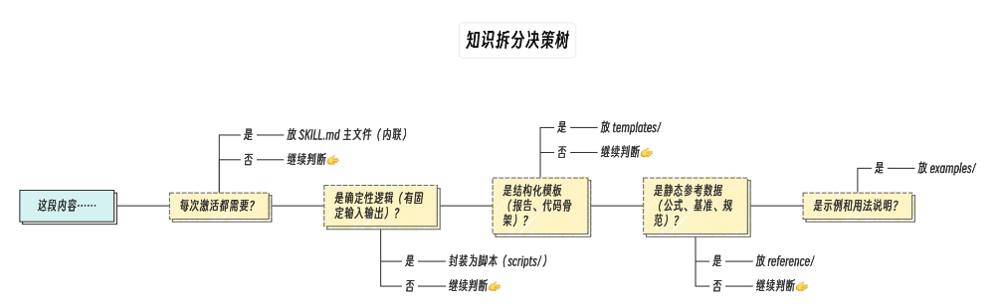
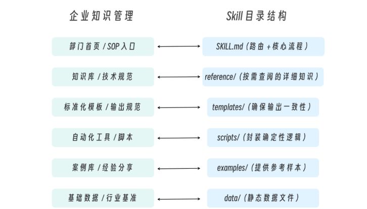

# 013 · 11｜循序渐进：渐进式披露架构设计

> 📖 原文出处：[极客时间 - 黄佳《Claude Code 工程化实战》](https://time.geekbang.org/column/article/946847)
>
> 📅 学习时间：2026-07-04

---

## 这篇文章在回答什么问题？

1. **复杂 Skill 怎么组织？** 如果 Skill 包含公式、模板、脚本、数据、示例——全塞进一个 SKILL.md 会导致 Token 爆炸和信息噪声。怎么分层？
2. **渐进式披露的三层架构是什么？** 目录页（description）→ 章节（SKILL.md）→ 附录（按需加载文件）。每一层怎么设计？
3. **SKILL.md 怎么当「路由器」用？** 不是把所有内容写进去，而是用 Quick Reference 表格做路由判断，导向对应的 reference 文件。
4. **怎么决定什么放 SKILL.md、什么放引用文件、什么放脚本？** 有一个知识拆分决策树。核心原则：核心语义内联、确定逻辑外包、结构独立、数据延迟。

---

## 原文转述

### 一、为什么需要渐进式披露

场景：一个财务分析 Skill 包含指标计算公式、行业基准数据、报表模板、分析脚本、示例。全塞进 SKILL.md：

- Token 爆炸：每次激活加载几千 tokens
- 信息噪声：用户问「收入增长率怎么算」，Claude 却要读成本分析、现金流、资产负债表的全部内容

**渐进式披露 = 图书馆检索模型**：先看目录（description）→ 选一本书（SKILL.md）→ 翻到需要的章节（引用文件）。信息逐层展开，而非一次性载入。

**认知经济学基础**：上下文窗口是 LLM 的「工作记忆」——200K tokens 但有限，存在注意力稀释效应。渐进式披露的本质：**以最小 token 投入获得最高任务完成质量——知识的投资回报率（Knowledge ROI）**。



---

### 二、三层架构：目录 → 章节 → 附录

**层级 1：目录页（Entry Point）**

只有 description。所有 Skill 的 description 共享 15,000 字符总预算。

```yaml
description: Analyze financial data, calculate ratios, and generate reports.
Use when the user asks about revenue, costs, profits, margins, financial metrics...
```

设计原则：足够丰富让 Claude 判断相关性，但不能太长（共享预算）。

**层级 2：章节（Main Content）**

SKILL.md 正文——激活后才加载。核心是**路由表**：

```markdown
| Analysis Type | When to Use | Reference |
|--------------|-------------|-----------|
| Revenue Analysis | 收入、营收、销售额相关 | `reference/revenue.md` |
| Cost Analysis | 成本、费用、支出相关 | `reference/costs.md` |
| Profitability | 利润、毛利率、净利率相关 | `reference/profitability.md` |
```

> 💡 SKILL.md 的本质是**路由器**——根据用户请求类型导向不同资源文件。Quick Reference 表格用 3 行（~50 tokens）告诉 Claude 五个方向的路由。如果没有这表格，Claude 需要读完整份文件才知道去哪找。

**路由表设计法则**：用「用户可能说的关键词」做路由条件、每个条目一行（不超过 10 条）、高频路由放前面。

**层级 3：附录（On-Demand Resources）**

只有当 SKILL.md 引用时才会加载。包含：reference/（知识库）、templates/（输出模板）、scripts/（可执行脚本）、data/（静态数据）。

```
.claude/skills/financial-analyzing/
├── SKILL.md              # 主文件（总是加载）
├── reference/            # 按需加载的知识
│   ├── revenue.md
│   ├── costs.md
│   └── profitability.md
├── templates/            # 输出格式
├── data/                 # 静态数据
└── scripts/              # 确定性计算
    └── calculate_ratios.py
```


---

### 三、契约式引用

引用辅助文件时不要只写路径——写一个**契约**：

```markdown
# ❌ 弱引用（Claude 不知道何时该加载）
See `reference/revenue.md` for more details.

# ✅ 契约式引用（触发条件 + 路径 + 内容预期）
## Revenue Analysis
When the user asks about revenue growth, ARPU, or revenue composition:
→ Load `reference/revenue.md` for calculation formulas and industry benchmarks
```

**契约三要素**：触发条件（什么情况下加载）+ 文件路径 + 内容预期（加载后能得到什么）。

> 💡 黄佳老师指出这和 SubAgent 流水线中的「交接契约」是同一个工程思想——**下游消费者需要知道上游提供什么，而不只是知道上游在哪里**。

---

### 四、脚本：把知识变成行动

脚本是 Skills 与 Tools 的桥梁——把公式固化为代码，Claude 执行但不需要理解。

```
没有脚本：Read(data.json) → Claude 内部计算 → 消耗推理 token → 可能出错
有脚本：  Bash(python calculate.py data.json) → 直接获得结果
```

**脚本适合**：财务比率计算、数据格式转换、文件批量处理（复杂但确定性的逻辑）。

**脚本不适合**：开放性分析、创意任务、交互式决策。

> 💡 **渐进式披露的极致**：Claude 只需知道「运行什么命令」（10 tokens），而非「如何生成 HTML」（2000+ tokens）。

---

### 五、知识拆分决策树

```
这块内容是做什么的？
├── 高频核心指令 → SKILL.md
├── 路由导航 → Quick Reference 表格（在 SKILL.md 中）
├── 详细知识（不常变）→ reference/
├── 输出格式 → templates/
├── 示例（输入输出样本）→ examples/
├── 确定性逻辑 → scripts/
└── 静态数据（JSON/CSV）→ data/
```

**500 行法则**：SKILL.md 超过 500 行就该重构。超过 500 行意味着把「参考资料」混进了「路由指令」。

**重构信号**：超过 500 行？有大量公式/代码/示例？Claude 经常加载无关章节？→ 拆分。

**核心原则**：核心语义内联、确定逻辑外包、结构独立、数据延迟、示例分离。



---

### 六、Skills × Tools 的三层关系

1. **Skills 约束 Tools**：通过 `allowed-tools` 实现最小权限。代码审查 Skill 只给 Read，不改代码。
2. **Skills 编排 Tools**：scripts/ 是预编译的 Tool 调用序列，比手动编排更可靠。
3. **Tools 反哺 Skills**：`! \`command\`` 预注入实时数据，Tools 输出注入 Skill 上下文。

> 💡 终点对比：**渐进式披露 vs 子代理隔离**——都是上下文管理策略。渐进式披露是「按需加载知识」（Skill 内部），子代理是「隔离执行噪声」（独立上下文）。两者互补，子代理可通过 `skills` 字段预加载 Skill。

---

### 七、企业SOP与SKILLS对标示例



1. KILL.md = 部门 SOP 首页。好的 SOP 首页不会把所有操作细节都列出来——它提供概览和导航，让使用者快速找到需要的章节。SKILL.md 的 Quick Reference 表格就是这个导航。
2. reference/ = 知识库。企业知识库的特点是内容丰富但使用频率低，按需查阅而非每次通读。Skill 的 reference 文件同理——只有 Claude 判断需要时才加载。
3. templates/ = 标准化输出。企业用模板确保报告、邮件、文档的格式一致。Skill 的模板同理——Claude 不需要每次都“创造”一个报告格式。
4. scripts/ = 自动化工具。企业用脚本和工具自动化重复性操作。这里的关键洞察是，脚本把“知识”变成了“行动“——它是 Skills（知识层）和 Tools（行动层）的桥梁。

---

## 核心框架

### 三层架构速查

```
层级1 目录页   description           扫描时读取   ~50 tokens
层级2 章节     SKILL.md（路由器）     激活后加载   <500行
层级3 附录     reference/ templates/  按需加载     不限
               scripts/ data/
```

### 契约式引用公式

```
[触发条件] → Load [文件路径] for [内容预期]
```

### 拆分决策树

```
高频核心 → SKILL.md | 详细知识 → reference/ | 输出 → templates/
示例 → examples/ | 确定逻辑 → scripts/ | 静态数据 → data/
```

---

## 评论区高价值讨论

### 🔥 1. 渐进式披露的真正含义

**读者 飞星（3 赞）**：SKILL.md 正文不是全部加载给 LLM 了吗？为什么说「渐进」？

**作者答**：**渐进式披露的「渐近」发生在引用文件层面（第三层），不是 SKILL.md 层面（第二层）。** SKILL.md 正文确实是全量加载的。Quick Reference 表格的价值是给模型做**注意力导航**——结构化格式 + 首位位置 = 更快的路由决策。

> 💡 关键澄清：渐进不是指 SKILL.md 的分段加载，而是指 reference/ 等第三层文件的按需加载。

---

### 🔥 2. 大文件怎么办？

**读者 纯齐（4 赞）**：如果 Skill 引用了行业法规 PDF 这种大文件，会把上下文迅速占满。

**作者答**：建议 `context: fork`——让大文件 token 开销留在子对话中，主对话只拿结果。其他方案：分片读取、摘要分离、脚本预处理、MCP 外置。**记住：SKILL.md 是菜单，不是菜本身。**

---

### 🔥 3. 不知道自己缺什么知识怎么写 Skill？

**读者 恍然大明白（2 赞）**：很多时候问大模型就是因为缺乏专业知识，如果我知道就不需要大模型了，怎么写 Skill？

**作者答**：**Skill = 人类对场景和流程的理解 + 人类和大模型的切磋探讨**。不是先「全知道」再写，而是在实践中逐步补充。这也是为什么评论区有人提到——把这篇文章喂给 CC，让它帮我们创建 Skills。

---

### 🔥 4. 脚本的 docstring = Tool 的 description

**读者 hunter（2 赞）**：data 数据怎么给到脚本？模型知道脚本需要什么格式吗？

**作者答**：脚本的 docstring 本质上就是 Tool 的 description。好的 Skill 脚本应做到：docstring 写清输入格式和示例、防御性检查、输出格式清晰。**这和 SKILL.md 的 description 引导 Claude「什么时候用」一样——docstring 引导 Claude「怎么用」。**

---

### 🔥 5. 实用碎片

- **20 个参考文件怎么组织**（多位读者讨论）：按领域分类建子目录 + SKILL.md 两级路由表 + INDEX.md 做三级渐进加载。如果还太多——问自己「这个 Skill 真的需要这么多文件吗？」最好的优化是减少数据量
- **Skills vs 自定义 Agent**（Demon.Lee，2 赞）：自建 Agent 效果不如 CC 内置的可能原因——上下文管理的信噪比问题。建议聚焦分层加载、语义路由、指令与知识分离
- **reference/、templates/ 文件夹名不是标准**（Superdandan）：可按业务领域自定义命名

---

## 相关链接

- 📁 [原文原始数据](../article-origin/013/)
- 🗂 [阅读指南](../000-阅读指南/)
