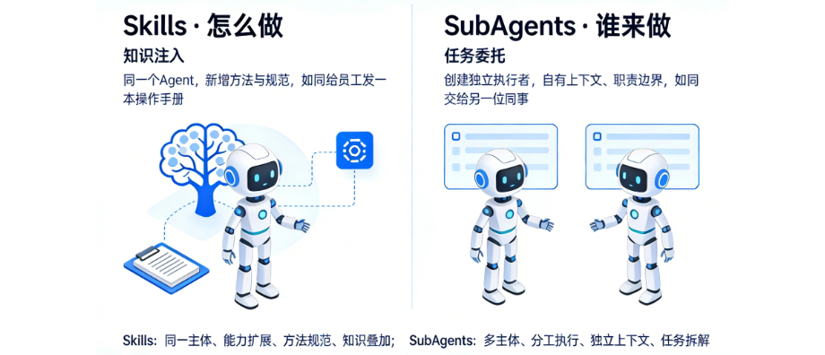
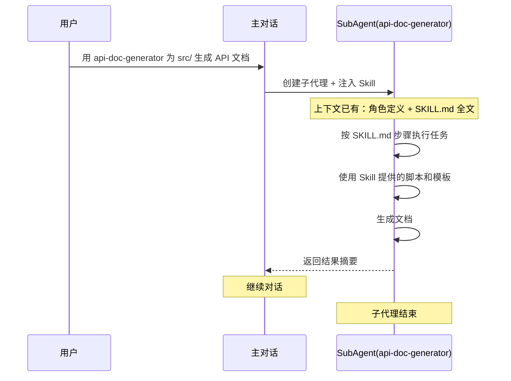
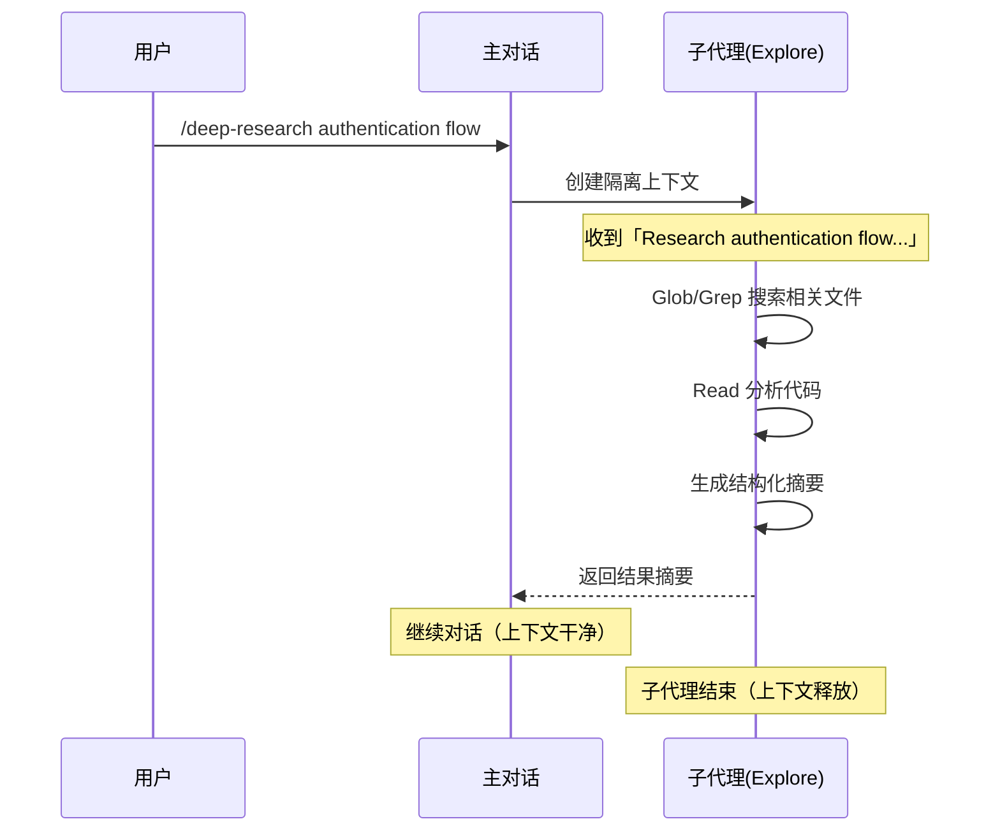
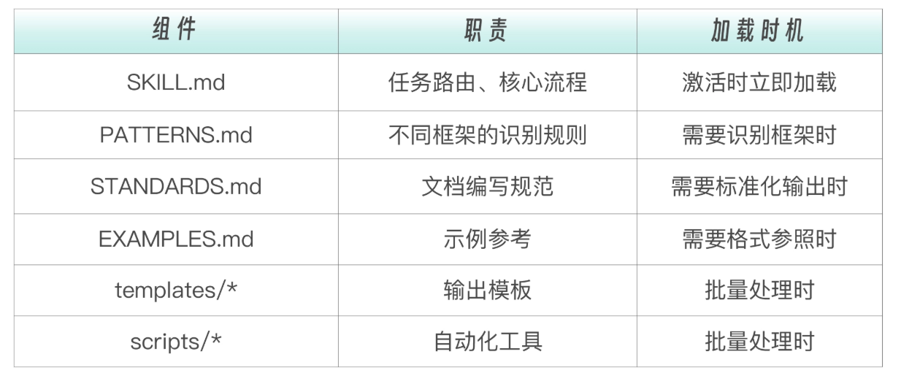

# 014 · 12｜珠联璧合：Skills 与 SubAgent 配合实战

> 📖 原文出处：[极客时间 - 黄佳《Claude Code 工程化实战》](https://time.geekbang.org/column/article/947718)
>
> 📅 学习时间：2026-07-04

---

## 这篇文章在回答什么问题？

1. **Skills 和 SubAgent 怎么组合使用？** 前面 SubAgent 专题和 Skills 专题各自独立学了，这篇终于把两者拼起来。核心是两个原子方向：SubAgent 包含 Skill（`skills` 字段）vs Skill 包含 SubAgent（`context: fork`）。
2. **什么时候用哪个方向？** 判断标准就一句话：这件事到底需要「另一个人」来承担，还是只需要「多一本手册」来指导？
3. **三种实战组合模式怎么玩？** 模式一（SubAgent 预加载 Skill，最常见）、模式二（Skill + context: fork，最简洁）、模式三（流水线中多 Skill 分工，最强大）。

---

## 原文转述

### 一、两个原子方向



黄佳老师先澄清了 Skills 和 SubAgent 各自的定位：

- **Skill**：回答「怎么做」，本质是知识注入——像给员工发了一本操作手册。
- **SubAgent**：回答「谁来做」，本质是任务委托——像把任务交给另一位同事。

**选择标准**：这件事需要「另一个人」来承担 → SubAgent；只需要「多一本手册」来指导 → Skill。

**方向 A：SubAgent 包含 Skill（`skills` 字段）**

```yaml
# SubAgent 是老板，Skill 是工具书
skills:
  - api-generating
```

Skill 内容在 SubAgent 启动时**全量注入**到它的上下文——没有渐进式披露的过程，因为 SubAgent 生命周期短、任务单一。

**执行流程**：`用 api-doc-generator 为 src/ 生成 API 文档`



**方向 B：Skill 包含 SubAgent（`context: fork`）**

```yaml
# Skill 是老板，SubAgent 是执行者
context: fork
agent: Explore
```

Skill 自带任务指令，通过 `context: fork` 自动派一个子代理去执行。只需一个 SKILL.md 文件，不需要额外的 agent 定义。

**执行流程**：`/deep-research authentication flow`



---

### 二、构建一个生产级 Skill

以 API 文档生成器为例，一个生产级 Skill 的完整架构：

```
.claude/skills/api-generating/
├── SKILL.md          # 入口：路由 + 核心逻辑
├── PATTERNS.md       # 知识：框架识别模式
├── STANDARDS.md      # 规范：文档编写标准
├── EXAMPLES.md       # 示例：输入输出案例
├── templates/        # 输出模板
└── scripts/          # 可执行脚本
```



SKILL.md 设计要点：Quick Reference 表格做路由、清晰的步骤流程、按需指引（只在需要时才去读详细文档）。

---

### 三、三种组合模式

**模式一：SubAgent 预加载 Skill**

最常见的模式。一个子代理预加载一个或多个 Skill。

```
project/
├── .claude/agents/api-doc-generator.md   # SubAgent：角色 + 使命
└── .claude/skills/api-generating/        # Skill：工作流程 + 工具
```

**Skill 精简化**：从独立 Skill 的 6 组件精简为 3 组件。因为 SubAgent 已有角色定义，Skill 只需提供工作流程和工具。参考型知识（PATTERNS、STANDARDS）在主对话场景有用，但 SubAgent 以执行流程为主。

**职责划分**：
- SubAgent 负责 WHO/WHAT（你是谁 + 要做什么任务）
- Skill 负责 HOW（按什么流程、用什么工具）

**进化路线**：Skill 独立运行 → Skill + SubAgent 组合。同一个 Agent 注入不同 Skill 就变成不同专家。

**模式二：Skill + context: fork**

只需一个 SKILL.md，无需 SubAgent 定义文件。适合研究型任务、重型生成、安全隔离。

```yaml
context: fork
agent: general-purpose    # 子代理类型（或 Explore/Plan）
```

> 💡 与模式一的本质区别：模式一需要显式 SubAgent 定义 + skills 字段。模式二只需一个 SKILL.md，CC 自动创建子代理。入口不同——SubAgent 只能显式派遣，Skill+fork 可以语义自动触发。

**模式三：流水线中的 Skill 分工**

多个子代理各自预加载不同 Skill，按阶段串联执行。

```
Stage 1: Route Scanner (haiku)     → route-scanning Skill    → JSON 路由清单
Stage 2: Doc Writer (sonnet)       → doc-writing Skill       → 标准化文档
Stage 3: Quality Checker (haiku)   → quality-checking Skill  → PASS/NEEDS_REVISION
```

**流水线三要点**：① 定义清晰阶段间接口（JSON → 文件列表 → 质量报告）② 每个 Skill 只关注一件事（单一职责）③ 编排逻辑集中管理（CLAUDE.md 中），调整流程只需改一处。

---

### 四、最终职责划分

```
SubAgent = WHO + WHAT（是谁、做什么）
Skill    = HOW + WITH_WHAT（怎么做、用什么做）
CLAUDE.md = WHEN + ORDER（什么时候做、按什么顺序做）
```

**选型反模式**：
- ❌ 单个 Agent 角色过载（5+ 个 Skill 预加载）→ 拆分
- ❌ Skill 内容过大（500+ 行无引用）→ 渐进式披露
- ❌ 编排逻辑分散在多个 agent 文件中 → 集中到编排层

---

## 核心框架

### 两种组合方向

| | 方向 A | 方向 B |
|------|-------|-------|
| **关系** | SubAgent 包含 Skill | Skill 包含 SubAgent |
| **配置** | `skills: [xxx]` | `context: fork` |
| **触发** | 显式派遣 SubAgent | Skill 语义自动触发 |
| **需要文件** | agent.md + SKILL.md | 只需 SKILL.md |

### 三种模式速查

| 模式 | 复杂度 | 适合 |
|------|-------|------|
| SubAgent+Skill | 中 | 领域专家型任务 |
| Skill+fork | 低 | 独立研究/重型生成 |
| 流水线+多 Skill | 高 | 多阶段串行任务 |

### 职责分离黄金法则

```
SubAgent 定义「是谁、做什么」
Skill    定义「怎么做、用什么做」
主对话   负责编排调度
```

---

## 评论区高价值讨论

### 🔥 1. SubAgent 中 Skill 是全量加载还是渐进式？

**读者 hunter（12 赞）**：SubAgent 里的 skills 字段是渐进式还是全量加载？

**作者答**：**全量加载。** 主 Agent 中的 Skill 是渐进式披露（按需触发），SubAgent 中通过 `skills:` 字段预加载是**全量注入**——在 SubAgent 创建时一次性把 SKILL.md 完整内容注入。不需要渐进式，因为 SubAgent 生命周期短、任务单一。

> 💡 这个澄清非常重要——之前我们一直说 Skills 是渐进式加载，但这个「渐进」特指主对话中的语义触发模式。SubAgent 的 `skills` 字段是另一套机制。

---

### 🔥 2. 流水线编排应该放 CLAUDE.md 吗？

**读者 james（1 赞）**：为什么把流水线编排定义在 CLAUDE.md 里？应该定义一个 pipeline skill。

**作者答**：你的工程直觉很对。CLAUDE.md 应该只放不可商量的底线规则。教学演示中放在 CLAUDE.md 是为了简化，最佳实践是——编排 Skill 管「做什么」、SubAgent 管「隔离做」、领域 Skill 管「按什么标准做」，三件事各管各的。

---

### 🔥 3. 可以脱离 Skill 去谈 SubAgent 吗？

**读者 西兰花（2 赞）**：技能真正有意义，我们可以脱离 SubAgent 谈 Skill，但能脱离 Skill 谈 SubAgent 吗？

**作者答**：Skills 是人的能力的一部分。但 SubAgent 除了 Skills 外还有 `tools`、`model`、`permissionMode`、`hooks` 等 frontmatter fields——角色不只是技能的集合，还有权限边界和执行环境。

> 💡 评论区另一位的精炼总结：「Skill 像固定函数，SubAgent 像高阶函数」——传入不同 Skill 产生不同专家行为。

---

## 相关链接

- 📁 [原文原始数据](../article-origin/014/)
- 🗂 [阅读指南](../000-阅读指南/)
