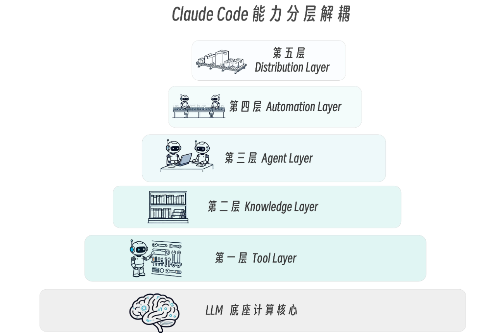
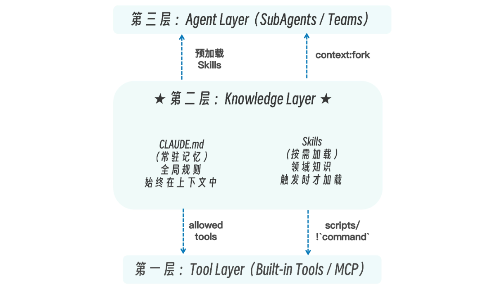
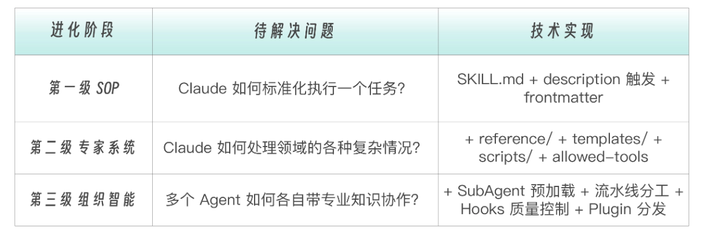
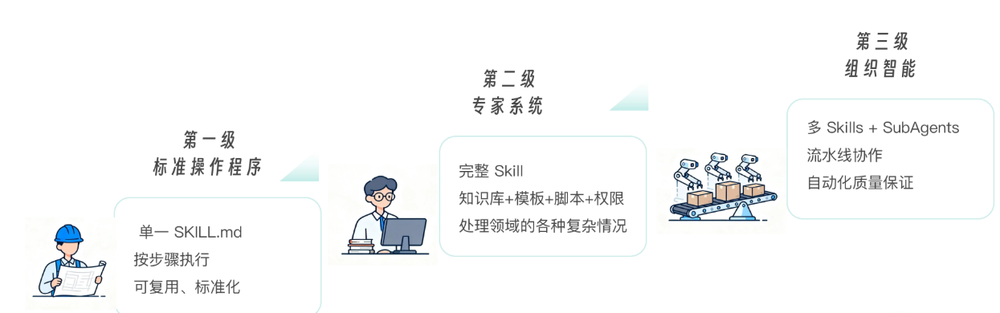
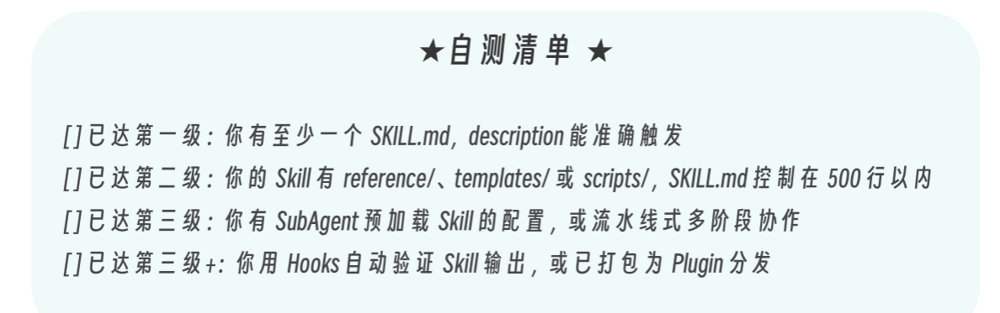
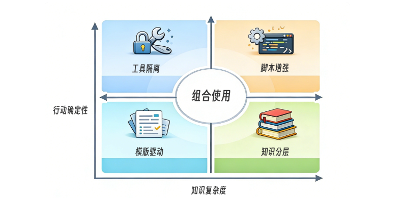
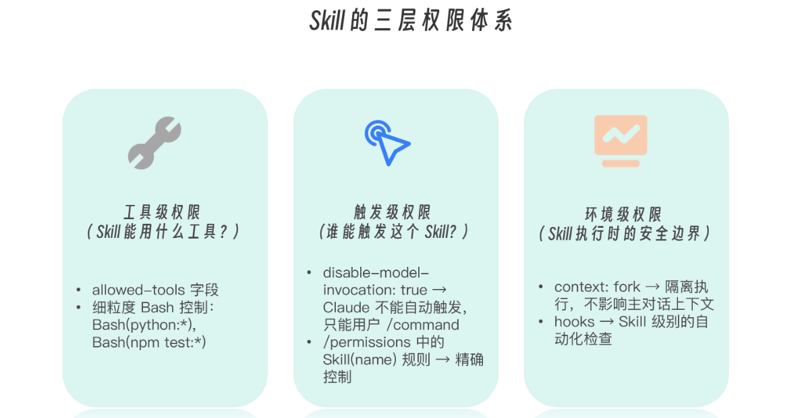
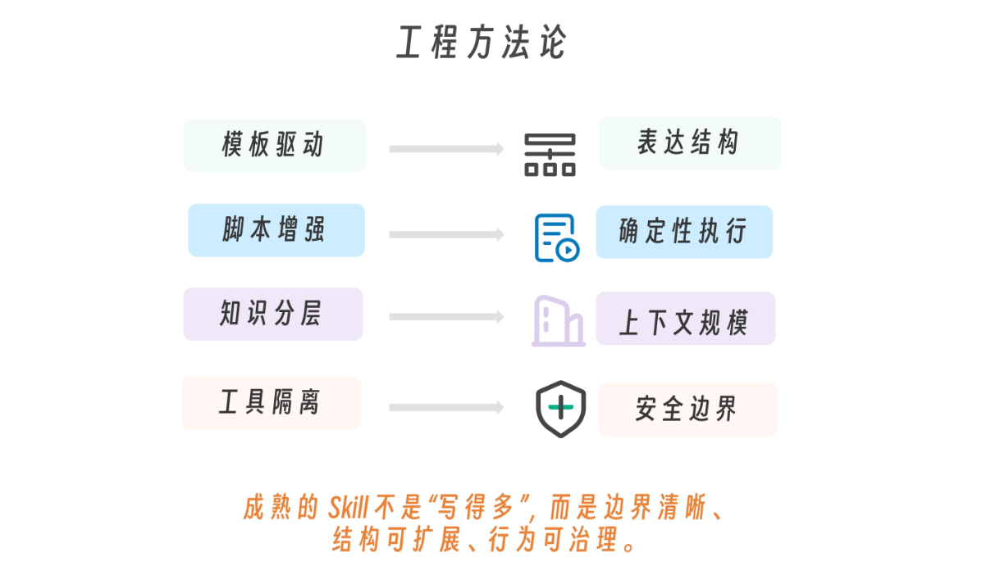

# 015 · 13｜纲举目张：Skills 架构定位与设计模式

> 📖 原文出处：[极客时间 - 黄佳《Claude Code 工程化实战》](https://time.geekbang.org/column/article/948037)
>
> 📅 学习时间：2026-07-04

---

## 这篇文章在回答什么问题？

1. **Skills 在 Claude Code 五层架构中处于什么位置？** 之前学了 SubAgent 和 Skills 各自是什么、怎么组合，这篇回到全景视角——Skills 在知识层，处于「工具层之上、智能体层之下」，承上启下。
2. **Skills 的「三级进化」是什么？** SOP（单 Skill 标准化）→ 专家系统（领域能力包）→ 组织智能（多 Skill + SubAgent 协作）。你的项目在哪一级？
3. **设计 Skill 有哪四种模式？** 模板驱动、脚本增强、知识分层、工具隔离——不是技巧，是职责分离的体现。
4. **权限体系怎么设计？** 三层权限：工具级（能做什么）+ 触发级（谁能触发）+ 环境级（在什么边界内运行）。

---

## 原文转述

### 一、Skills 在五层架构中的位置

黄佳老师用「纲举目张」开篇——提起鱼网的总绳（纲），所有网眼（目）自然张开。

```
LLM 底座（CPU + Runtime）
    │
第一层 Tool Layer        工具层 — 系统可调用的原子能力
第二层 Knowledge Layer   ★ Skills — 结构化 SOP 注入（承上启下）
第三层 Agent Layer        智能体层 — SubAgents + Agent Teams
第四层 Automation Layer   自动化层 — Hooks 事件驱动
第五层 Distribution Layer 分发层 — Plugins 打包
```



Skills 处于知识层的核心位置：
- **向下**：通过 `allowed-tools` 和 `scripts/` 约束编排 Tools（知识约束行动）
- **向上**：为 SubAgents 预加载专业知识（知识服务决策）
- **平行**：与 CLAUDE.md 互补——CLAUDE.md 是常驻通识背景，Skills 是按需加载的专业知识



> 💡 这就是为什么 Skills 要设计成「按需加载」——如果 Skills 常驻，它就退化成了 CLAUDE.md 的一部分，失去了「精准投放知识」的架构优势。**渐进式披露不是「省 token 的技巧」，而是知识层架构的必然要求。**

如果把 Claude Code 五层架构看作一栋工程化系统大厦，可以按“能力分层解耦”的方式理解。
- LLM 是底座计算核心，相当于 CPU + Runtime，负责推理与控制循环（agentic loop）。
- 第一层 Tool Layer 是最底层的执行接口层，类似操作系统的 syscall 或基础设施 API，定义“系统可调用的原子能力”。
- 第二层 Knowledge Layer 是策略与操作规约层，Skills 本质是结构化 SOP 注入机制，解决“在什么上下文下，以什么步骤调用哪些工具”。
- 第三层 Agent Layer 是执行编排层，SubAgents 提供隔离执行单元，Agent Teams 提供多单元协作拓扑，解决复杂任务拆解与职责分离。
- 第四层 Automation Layer 是事件驱动控制层，Hooks 像 middleware 或 pipeline 拦截器，在关键节点注入自动化校验与约束逻辑。
- 第五层 Distribution Layer 是能力封装与交付层，Plugins 将前述能力模块化、版本化，实现跨项目与跨组织复用。


---

### 二、三级进化：SOP → 专家系统 → 组织智能



| 级别 | 特征 | 解决的问题 | 对应组件 |
|------|------|----------|---------|
| **SOP** | 一个 Skill 解决一个标准化任务，步骤可复现 | 可执行 | 单一 SKILL.md |
| **专家系统** | 知识库 + 模板 + 脚本 + 权限，成为领域能力包 | 复杂变体 | 渐进式披露 + scripts/ + templates/ |
| **组织智能** | 多 Skills + SubAgents 流水线 + Hooks + Plugins | 规模协作 | Skill + SubAgent + Hook 组合 |



**自测清单**：
- 只有一个 SKILL.md 且没有辅助文件 → SOP 阶段
- 有 reference/、templates/、scripts/、allowed-tools → 专家系统
- 多个 SubAgents + Skills 协作 + 编排逻辑 → 组织智能



> 💡 大多数项目在第二级就能满足需求。黄佳老师强调：**不需要为了「高级」而过度设计**——选择与问题复杂度匹配的级别。

---

### 三、四种设计模式



**① 模板驱动模式**：用模板强制约束输出结构，让结果稳定、可对比。解决「输出不稳定」。

```
SKILL.md + templates/ → 标准化输出格式
```

原则：模板 > 100 行 = 职责混乱应拆分；模板中出现 if/else = 边界打破，逻辑应放 SKILL.md。

**② 脚本增强模式**：把计算、匹配等确定性逻辑交给脚本，不靠 Claude 推理。解决「结果不稳定」。

```
SKILL.md + scripts/ → 确定性执行替代概率推理
```

原则：脚本用标准库、无交互输入、只管确定性逻辑。判断和语义理解留给 Claude。

**③ 知识分层模式**：按使用频率组织知识，高频内联、中低频按需。解决「上下文膨胀」。

```
SKILL.md（核心清单 <500行）+ QUICKREF.md + reference/ → 渐进加载
```

触发条件：**SKILL.md 超过 500 行时。**

**④ 工具隔离模式**：通过 `allowed-tools` 明确能力边界。解决「越权风险」。

```yaml
# 审计：只读
allowed-tools: [Read, Grep, Glob]
# 生成：只写不改
allowed-tools: [Read, Grep, Glob, Write]
# 分析：只读 + 脚本
allowed-tools: [Read, Grep, Glob, Bash(python:*)]
```

---

### 四、生产级 Skill = 四种模式组合

```
api-generator = 模板驱动 + 脚本增强 + 知识分层 + 工具隔离

├── SKILL.md               ← 知识分层（路由器，500 行以内）
├── PATTERNS.md            ← 知识分层（按需加载）
├── templates/endpoint.md  ← 模板驱动（标准化输出）
├── scripts/detect.py      ← 脚本增强（确定性路由检测）
└── allowed-tools          ← 工具隔离（Write 但不给 Edit）
```

**组合决策树**：
```
需要标准化输出？→ templates/（模板驱动）
需要确定性计算？→ scripts/（脚本增强）
知识量 > 500 行？→ reference/（知识分层）
安全边界控制？→ allowed-tools（工具隔离）
```

---

### 五、三层权限体系



| 层级 | 回答的问题 | 机制 |
|------|----------|------|
| **工具级** | 能做什么？ | `allowed-tools` |
| **触发级** | 谁能触发？ | `disable-model-invocation` + `user-invocable` |
| **环境级** | 在什么边界内运行？ | `context: fork` + `permissionMode` + `hooks` |

---

## 核心框架

### 五层架构中 Skills 的位置

```
工具层（能做什么）→ Skills 知识层（怎么做）→ 智能体层（谁来做）
```

### 三级进化

```
SOP（可执行）→ 专家系统（可扩展）→ 组织智能（可规模化）
```

### 四种设计模式速查

| 模式 | 核心 | 配置 |
|------|------|------|
| 模板驱动 | 约束输出 | templates/ |
| 脚本增强 | 确定性替代推理 | scripts/ |
| 知识分层 | 按频率组织 | reference/ + QUICKREF.md |
| 工具隔离 | 明确不能做什么 | allowed-tools |

### 工程方法论



---

## 评论区高价值讨论

### 🔥 1. 跨多系统业务知识怎么组织？

**读者 刘勇（6 赞）**：垂直电商多个子系统（商品/支付/物流），跨系统改动时 AI 搞不懂怎么改。业务知识用什么组织——Skill 还是 Knowledge？

**作者答**（三层方案）：
1. **全局架构地图**（50-100 行）→ 让 AI 知道「有哪些系统存在」+ 变更规则
2. **领域知识 Skill**（每个子系统一份）→ 商品/支付/物流各自业务概念和接口
3. **跨系统影响分析器**（SubAgent）→ 串联前两层，输出完整改动面

> 💡 这和我们在 SubAgent 专题学的 impact-analyzer + chain-knowledge Skill 是同一套思路。

---

### 🔥 2. Skills ≠ SOP？——企业本体论映射的另一种视角

**读者 欧阳荣（0 赞）**：作者说 CLAUDE.md = 企业文化、Skills = SOP——这个映射不完全通。CLAUDE.md 更像是「岗位说明书 + 行为规范」，Skills 更像是「能力池」而非流程本身。

**作者答**：这是 ChatGPT 拆的风格——短句多、核心直给。

> 💡 不同视角都有道理。关键不是映射是否精确，而是这套本体论框架能帮你发现架构设计中的盲点。

---

## 相关链接

- 📁 [原文原始数据](../article-origin/015/)
- 🗂 [阅读指南](../000-阅读指南/)
