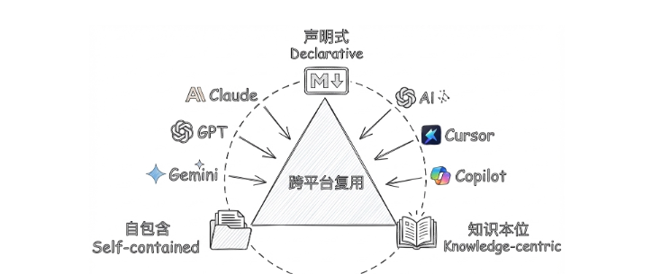
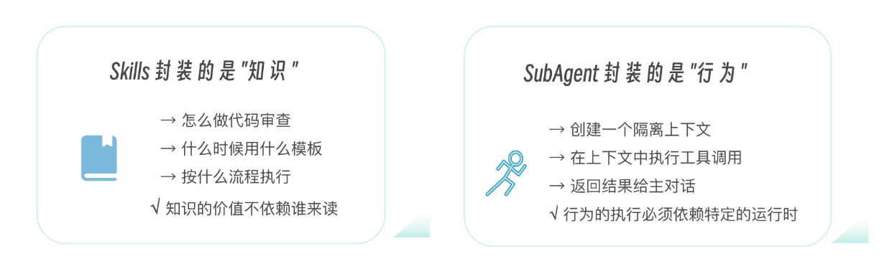
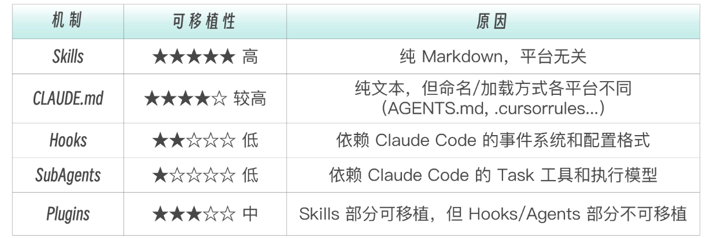

# 016 · 14｜星火燎原：从 Claude Code 到行业开放标准

> 📖 原文出处：[极客时间 - 黄佳《Claude Code 工程化实战》](https://time.geekbang.org/column/article/952321)
>
> 📅 学习时间：2026-07-04

---

## 这篇文章在回答什么问题？

1. **Skills 为什么能从一个产品特性变成行业开放标准？** 百天时间内，27+ 平台原生支持，52,000+ Skills 被注册。核心原因：声明式、自包含、知识本位。
2. **为什么 SubAgents 不能出圈，而 Skills 能？** Skills 封装的是知识（可迁移），SubAgents 封装的是行为（绑定平台运行时）。越接近「纯知识」越容易跨平台。
3. **AAIF 是什么？** Agentic AI Foundation——AI 时代的 W3C，三大创始项目：MCP（工具接口标准）、goose（执行框架）、AGENTS.md（项目上下文标准）。
4. **Push vs Pull 怎么选？** AGENTS.md（Push 常驻）vs Skills（Pull 按需）——Vercel 实验数据 + 场景矩阵：高频少量 → Push，偶尔大量 → Pull。

---

## 原文转述

### 一、Skills 出圈的时间线

```
2025.10  Claude Code 上线 Skills
2025.12  Anthropic 开放 Skills 标准
2025.12  AAIF 成立（Anthropic + OpenAI + Block）
2026.01  Vercel 推出 skills.sh（Skills 的 npm）
2026.02  27+ 平台支持，52,000+ Skills，Top Skill 安装量 180,000+
```

**核心洞察**：Anthropic 开放 Skills 不是因为做慈善——**标准的价值大于独占的价值**。当你的格式成为行业标准，每个人创建的 Skills 都在增强你的生态。就像 Intel 发明了 USB 但开放后全世界都在用，Intel 反而获益最大。

---

### 二、Skills 出圈的三个本质属性

| 属性 | 含义 | 为什么重要 |
|------|------|----------|
| **声明式** | 纯 Markdown，无编译、无依赖 | 任何 LLM 都能读 |
| **自包含** | 一个文件夹即完整能力包 | git clone 就是安装 |
| **知识本位** | 价值在内容本身 | 知识不绑定平台 |



**为什么 SubAgents 不能出圈？** 因为 Skills 封装的是知识（纯文本，可迁移），SubAgents 封装的是行为（需要运行时、权限系统、工具调度）。越接近「纯知识」越容易跨平台，越接近「运行时行为」越绑定平台。



**可移植性排序**：Skills > Commands > Hooks > SubAgents > Agent Teams



---

### 三、AAIF——AI 时代的 W3C

| 项目 | 贡献方 | 解决的问题 |
|------|-------|----------|
| **MCP** | Anthropic | Agent 如何连接工具？ |
| **goose** | Block | Agent 如何落地执行？ |
| **AGENTS.md** | OpenAI | Agent 如何理解项目？ |

Agent Skills 不是三大创始项目之一，但天然与三者关联——MCP 提供工具、Skills 提供使用知识；goose 原生支持 Skills；AGENTS.md 与 Skills 是 Push vs Pull 的互补关系。

---

### 四、Push vs Pull：AGENTS.md vs Skills

Vercel 实验结论：**高频少量 → Push（AGENTS.md 常驻），偶尔大量 → Pull（Skills 按需）。**

```
知识量少(< 8KB)     知识量大(> 50KB)
每次都需要   Push(AGENTS.md)    Push + 压缩
偶尔需要     都行               Pull(Skills)
```

> 💡 这和我们第 3 讲学的 CLAUDE.md vs Skills 是同一套设计决策——不是二选一，是组合使用。

---

### 五、对学习/使用者意味着什么

1. **学一次，到处用**：你在 CC 中设计的 Skill 可以直接用于 Cursor、Copilot、Codex CLI
2. **Skill 工程能力是行业级能力**：就像 2015 年学 REST API 设计
3. **Skills 是 AI 时代的 package.json**：不同的是，`SKILL.md` 给 AI 读的是 Markdown 而非 JSON

> 💡 Skills 出圈的本质：AI 时代的「运行时」是 LLM 本身——自然语言可以直接被「编译」为行动。知识第一次具备了可执行性，成为可迁移、可复用、可标准化的资产。

---

## 核心框架

### Skills 出圈三属性

```
声明式 → 任何 LLM 能读 | 自包含 → 任何文件系统能存 | 知识本位 → 价值不绑定平台
```

### Push vs Pull 决策

```
每次都需要 + 少量 (<8KB)   → Push (AGENTS.md / CLAUDE.md)
偶尔需要 + 大量 (>50KB)    → Pull (Skills)
```

---

## 评论区高价值讨论

### 🔥 1. Skill 自动触发不一定完美

**读者 Jxin（6 赞）**：很多场景下 `/command` 显式调用才是正确选择。自动触发在弱模型 + 复杂项目场景下确实不靠谱。

**作者答**：自动触发不是问题，**不会管理自动触发才是问题**。这是「对使用者的成熟度有要求的设计」。

---

### 🔥 2. AI 都能写 Skill 了，还用学吗？

**读者 ub8（5 赞）**：现在 AI 都能写 skill 了，这课程还有必要学吗？

**作者答**：学到**至少不被 AI 蒙骗的程度**——可以不动手，但必须懂原理。AI 编程很牛，编程还用学吗？用学。同理，AI 写文章很漂亮，但自己写出来的东西味道不一样。

---

### 🔥 3. 声明式的生命力

**读者 zhangwq（2 赞）**：正则表达式和 SQL 都是声明式的，编程语言几经发展，这两位屹立不倒。

**作者答**：正则声明「匹配什么」不管引擎怎么匹配；SQL 声明「查什么数据」不管数据库怎么查；**Skills 声明「做什么事」不管 Agent 怎么做。**

---

## 相关链接

- 📁 [原文原始数据](../article-origin/016/)
- 📖 [Agent Skills 开放标准](https://agentskills.io/specification)
- 📖 [skill-creator](https://github.com/anthropics/skills/tree/main/skills/skill-creator)
- 🗂 [阅读指南](../000-阅读指南/)
