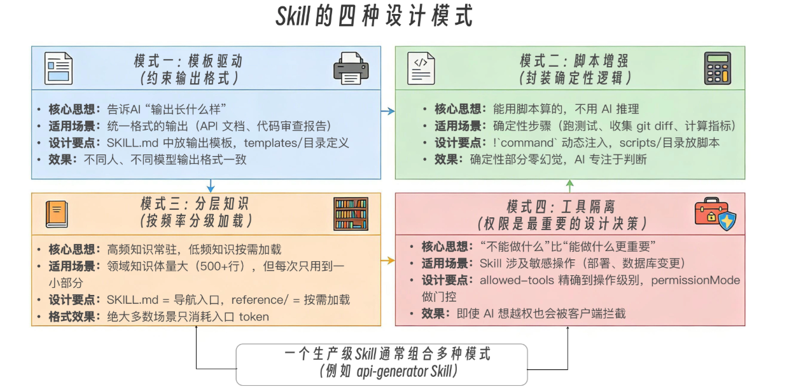

# 017 · Skills 专题阶段性总结

> 📖 原文出处：[极客时间 - 黄佳《Claude Code 工程化实战》加餐：Skills 专题总结](https://time.geekbang.org/column/article/952329)
>
> 📅 总结时间：2026-07-04
>
> 📚 覆盖范围：011-016 共六篇 Skills 学习笔记 + 本文

---

## 结论先行：Skills 到底是什么？

六讲下来，Skills 的终极定义：

**Skills 是 Claude Code 架构中的知识层，把人类组织几十年积累的知识管理经验（SOP、专家系统、组织学习）技术化映射到 AI Agent 架构中。**

它不是被动的文档——是有触发条件、有执行流程、有质量标准、有工具约束、有自动检查的**可操作知识体系**。

**Skills 与相关概念的关系**：

| 关系 | 机制 |
|------|------|
| Skills × Tools | 约束（allowed-tools）、编排（scripts）、反哺（!`command`） |
| Skills × SubAgents | 知识注入 vs 任务委托，互补组合 |
| Skills × CLAUDE.md | Push（常驻）vs Pull（按需），不是二选一 |

**Skills 出圈的根本原因**：声明式（纯 Markdown）+ 自包含（一个目录完整交付）+ 知识本位（价值在内容不在格式）。当格式趋近于纯知识时，采纳变成必然。

---

## 两层能力体系

```
第一层：知识工程（011-013）
    Skills 的结构与触发 → 知识怎么被加载
    任务型 Skills 实战    → 知识怎么变成命令
    渐进式披露架构       → 知识怎么高效组织

第二层：系统集成（014-016）
    Skills × SubAgent    → 知识怎么驱动智能体
    架构定位与设计模式   → 知识在五层架构中的位置
    行业开放标准         → 知识怎么跨平台迁移
```

**第一层解决知识管理问题**——让你的专业知识在 AI 需要时精准获取，不需要时不浪费上下文。

**第二层解决系统设计问题**——Skills 不是孤立的知识包，它和 SubAgents、Hooks、Plugins 组成完整工程体系。

---

## 演进路径

```
会写 SKILL.md → 会设计渐进式披露 → 会让 Skill 与 SubAgent 配合
→ 知道 Skill 在架构中的位置 → 理解它为什么是 AI 工程的关键基础设施
```

---

## 四种设计模式速查

| 模式 | 核心 | 触发条件 |
|------|------|---------|
| **模板驱动** | 约束输出格式 | 输出需要标准化 |
| **脚本增强** | 确定性替代推理 | 有确定计算/匹配逻辑 |
| **知识分层** | 按频率分级加载 | SKILL.md > 500 行 |
| **工具隔离** | 权限是设计决策 | 安全边界控制 |

四种模式不互斥——生产级 Skill 通常组合使用。



---

## 贯穿六讲的方法论

| 讲次 | 方法论 | 解决什么问题 |
|------|-------|------------|
| 011 | description 三要素 | 什么时候加载这个 Skill |
| 012 | 七步设计清单 | 怎么从零设计任务型 Skill |
| 013 | 知识 ROI 框架 | 知识太多怎么组织 |
| 014 | 两个原子方向 × 三种组合 | Skill 和 SubAgent 怎么配合 |
| 015 | 企业本体论映射 | 用哪个机制解决哪类问题 |
| 016 | Push vs Pull 框架 | 知识放在哪里最高效 |

**共同主线**：不是学写 SKILL.md 的模板，而是面对任何知识管理场景，能判断用什么机制、怎么组织、放在哪里、和谁配合。

---

## 原文综合案例：遗留代码现代化四阶段

```
Phase 1: 规范建立（模板驱动 + 分层知识）
    java-modernization Skill + reference/ + templates/

Phase 2: 标准流程固化（脚本增强 + 任务型）
    java-refactor-check Skill，disable-model-invocation: true

Phase 3: Skill × SubAgent 组合（领域专家）
    java-modernizer SubAgent，skills: [java-modernization, java-refactor-check]

Phase 4: 流水线中的 Skill 切换
    扫描→改造→检查→审查，四阶段串行
```

对比 SubAgent 专题的案例——子代理案例核心是「编排」，Skills 是配角；Skills 案例核心是「知识」，SubAgent 是载体。

---

## 我在六讲中的关键收获

1. **Skills 的本质不是 Prompt 工程，是知识管理**。学会了写 SKILL.md 只是入门，知道它放在哪里、和谁配合、为什么这样设计才是真正的能力。

2. **渐进式披露是知识层架构的必然要求**，不是省 token 的技巧。Skills 常驻就退化成了 CLAUDE.md。

3. **SubAgent 的 `skills` 字段是全量注入，不是渐进式**——这个区别在评论区才澄清，正文没明确讲。

4. **description 是 Skill 的灵魂**——它决定 Claude 何时加载。写作公式 `[做什么]+[怎么做]+[什么时候用]` 简单但实用。

5. **声明式 > 命令式**——Skills 能出圈的根本原因是纯 Markdown，任何 LLM 都能读。知识第一次具备了可执行性和跨平台可迁移性。

6. **Push vs Pull 不是二选一**——CLAUDE.md 放每次需要的少量规则，Skills 放偶尔需要的详细知识。两者互补。

---

## 待探索

1. Hooks 专题学习中关注 Skill 内 Hooks 的更多实战应用
2. Skills 的跨平台可移植性——我们的 api-generating Skill 能否在 Cursor/Copilot 中直接用？
3. 六讲方法论能否提炼为一个 Skill 设计 Checklist 供后续复用？

---

## 相关链接

- 📁 [原文原始数据](../article-origin/017/)
- 📝 本专题笔记：[011-SKILL.md结构与触发](../011-SKILL-md结构与触发机制/) | [012-任务型Skills](../012-任务型Skills命令实战/) | [013-渐进式披露](../013-渐进式披露架构设计/) | [014-Skills与SubAgent配合](../014-Skills与SubAgent配合实战/) | [015-架构定位](../015-Skills架构定位与设计模式/) | [016-行业开放标准](../016-Skills行业开放标准/)
- 🗂 [阅读指南](../000-阅读指南/)
